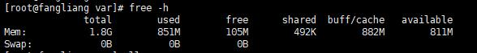
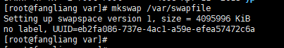
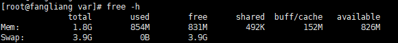
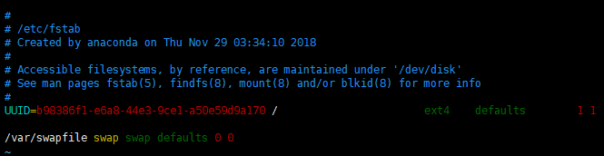

## 阿里云服务器增加虚拟内存

* 先查看一下自己的服务器swap大小，命令：

```
free -h
```



swap大小为0


* 找个地方建立swap的文件系统，我放在了/var目录下

```
dd if=/dev/zero of=/var/swapfile bs=800M count=5
```

> 这条命令从硬盘里分出一个800M ×5 = 4G 大小的空间，挂在swapfile上

> 注意：这里我们bs(buff size)给的800M, bs大小可以根据free -h命令查看的buff/cache的大小来决定，
如果给大了可能会报dd: memory exhausted by input buffer of size 1073741824 bytes (1.0 GiB) 

* swapfile文件创建后，需要构建swap格式于/var/swapfile 上

```
mkswap /var/swapfile
```



* 用命令激活swap，立即启用交换分区文件

```
swapon /var/swapfile
```



> 但是这样的设置重启后就失效了，为了保证每次启动都能启用该交换空间，需要手动编辑文件/etc/fstab中的swap行


```
vim /etc/fstab
```
将/swap none swap sw 0 0 这行注释掉(如果有)

新增一行 /var/swapfile swap swap defaults 0 0


