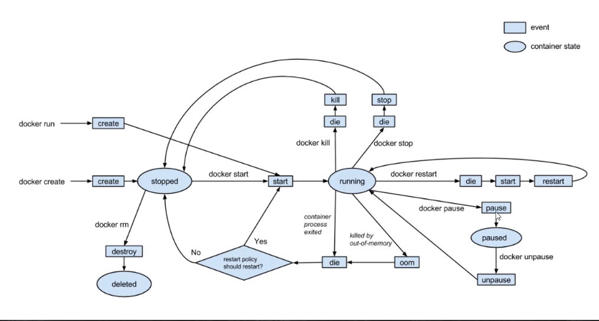

## 容器生命周期



## Dockerfile基础指令

* FROM

```text
FROM centos 制作基于基准镜像
FROM scratch 不依赖于任何基准镜像
```

* LABEL & MAINTAINER

```text
MAINTAINER abc.com
LABEL version="1.0
LABEL description="aaa"
```

* WORKDIR 设置工作目录

```text
WORKDIR /usr/local
WORKDIR /usr/local/newdir #自动创建

尽量使用绝对路径
```

* ADD & COPY 复制文件

```text
ADD hello / #复制到根路径
ADD test.tar.gz / #添加到根目录并解压
ADD除了复制，还具备添加远程文件功能，类似于curl或者wget
```

* ENV 设置环境常量

```text
ENV JAVA_HOME /usr/local/openjdk8
RUN ${JAVA_HOME}/java -jar test.jar
尽量使用环境常量，可以提高程序维护性
```

## Dockerfile运行指令

* RUN 在Build构建时执行命令

```text
RUN yum install -y vim  #shell命令格式

RUN ["yum","install","-y","vim"] #exec命令格式
```
> 使用shell执行是，当前shell是父进程，生成一个子shell进程，在子shell中执行脚本，脚本执行完毕，退出子shell，回到当前shell

> 使用exec方式，会用exec进程替换当前进程，pid保持不变，执行完毕直接退出，并不会退出之前的进程环境

* ENTRYPOINT 容器启动时执行的命令

> 用于在容器启动时执行命令，只有最后一个ENTRYPOINT会被执行

```text
ENTRYPOINT["ps"] #推荐使用exec格式
```

* CMD 容器启动后执行默认的命令或参数

> 多个CMD只有最后一个被执行

> 如果容器启动时附加指令，则CMD被忽略

```text
CMD["ps","-ef"] #推荐使用exec格式
```

* 可以用ENTRYPOINT和CMD组合，在启动容器时改变CMD传指令参数


## 更改阿里云镜像加速

到cmd中去依次执行：(如果提示无此命令，请先设置docker文件到环境变量，例如添加D:\Program Files\Docker Toolbox到系统变量)

```text
docker-machine ssh default
sudo sed -i "s|EXTRA_ARGS='|EXTRA_ARGS='--registry-mirror=https://9kpo0ctj.mirror.aliyuncs.com |g" /var/lib/boot2docker/profile
exit
docker-machine restart default
```


## 普通启动

```text
docker run -it centos /bin/bash
```

### 后台运行

```text
docker run -p 8000:8080 -d tomcat
```

## 将CMD或者entrypoint设置为/usr/sbin/init，执行初始化动作

```text
docker run -itd -p 10022:22  --privileged=true <imageId>  /usr/sbin/init
```

## 然后执行bash进入到centos命令行

```text
docker exec -it <containerId> /bin/bash
docker exec -it 3b0d0288303f /bin/bash
```

## 外部ssh连接

在使用ssh工具连接docker容器的时候，使用的ip地址不是docker容器的地址，也不能使用localhost、127.0.0.1，需要使用 docker-mechine IP default命令获取到虚拟Linux的IP地址，通过这个地址使用 ssh -p 10022 root@192.168.100.0（此地址是通过命令获取到的IP），然后才能登录

ssh -p 10022 root@192.168.100.0


## 挂载

```text
docker run -itd -p 10022:22  --privileged=true -v //e/Linux-files/linuxx64_12201_database:/mnt  27ec9f4b78cb /usr/sbin/init
docker run -itd -p 10022:22  --privileged=true -v "/E:\Linux-files\linuxx64_12201_database":/oracle  27ec9f4b78cb /usr/sbin/init
```
## --volumes-from 共享容器

```text
docker create --name webapps -v /webapps:/tomcat/webapps tomcat /bin/true #创建共享容器

docker run --volumes-from webapps --name t1 -d tomcat # 共享容器挂载点

```

## Docker Compose 容器编排工具

* 单机多容器部署工具

* 通过yml定义多容器如何部署

```text
docker-compose up -d #后台运行
docker-compose logs [containerName] #查看输出
docker-compose down  #关闭容器
```

## gone

### 列出的组列表里有GNOME Desktop。

```text
yum grouplist  
```

### 安装之

```text
yum groupinstall -y "GNOME Desktop" 
```

### 安装完成后，修改默认启动方式为图形化界面

```text
systemctl set-default graphical.target  //设置成图形模式 
```

### 如果要换回来 

```text
systemctl set-default multi-user.target  //设置成命令模式 
```

### 然后重启系统即可

###安装VNC服务软件，使用root用户执行以下命令

```text
yum install tigervnc-server -y
```
