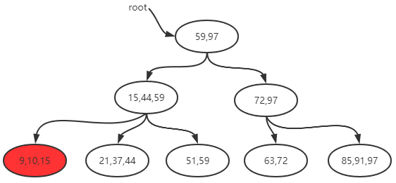

# B+树删除和添加图解

## B+树性质

1. 根结点只有1个，分支数量范围[2,m]。      
2. 除根以外的非叶子结点，每个结点包含分支数范围[[m/2],m]，其中[m/2]表示取大于m/2的最小整数。        
3. 所有非叶子节点的关键字数目等于它的分支数量。        
4. 所有叶子节点都在同一层，且关键字数目范围是[[m/2],m]，其中[m/2]表示取大于m/2的最小整数。        
5. 所有非叶子节点的关键字可以看成是索引部分，这些索引等于其子树（根结点）中的最大（或最小）关键字。例如一个非叶子节点包含信息: (n，A0,K0, A1,K1,……,Kn,An)，其中Ki为关键字，Ai为指向子树根结点的指针，n表示关键字个数。即Ai所指子树中的关键字均小于或等于Ki，而Ai+1所指的关键字均大于Ki（i=1，2，……，n）。        
6. 叶子节点包含全部关键字的信息(非叶子节点只包含索引)，且叶子结点中的所有关键字依照大小顺序链接(所以一个B+树通常有两个头指针，一个是指向根节点的root，另一个是指向最小关键字的sqt)。

## 初始

## 插入数据

### 插入数据9

* 初始

* 首先查找9应插入的叶节点(最左下角的那一个),插入发现没有破坏B+树的性质,完毕

### 向B+树中插入20

* 初始

* 首先查找20应插入的叶节点(第二个叶子节点),插入

* 发现第二个叶子节点已经破坏了B+树的性质,则把之分解成[20 21], [37 44]两个,并把21往父节点移

* 发现父节点也破坏了B+树的性质,则把之再分解成[15 21], [44 59]两个,并把21往其父节点移

### 向B+树中插入100

* 初始

* 首先查找100应插入的叶节点(最后一个节点), 插入

* 修改其所有父辈节点的键值为100(只有插入比当前树的最大数大的数时要做此步)

* 重复上述的方法开始拆分节点

## 删除数据

### 向B+树中删除91

* 初始

* 首先找到91所在叶节点(最后一个节点),删除之

### 向B+树中删除97

* 初始

* 首先找到97所在叶节点(最后一个节点),删除之，然后修改该节点的父辈的键字为91(只有删除树中最大数时要做此步)

### 向B+树中删除51

* 初始

* 首先找到51所在节点(第三个节点),删除之

* 破坏了B+树的性质,从该节点的兄弟节点(左边或右边)借节点44，并修改相应键值,判断没有破坏B+树,完毕

### 向B+树中删除59

* 初始

* 首先找到59所在叶节点(第三个节点),删除之

* 破坏B+树性质,尝试借节点,无效(因为左兄弟节点被借也会破坏B+树性质),合并第二第三叶节点并调整键值

* 向B+树中删除63

* 初始

* 首先找到63所在叶节点(第四个节点),删除之

* 合并第四五叶节点并调整键值

* 发现第二层的第二个节点不满足B+树性质,从第二层的第一个节点借59,并调整键值

