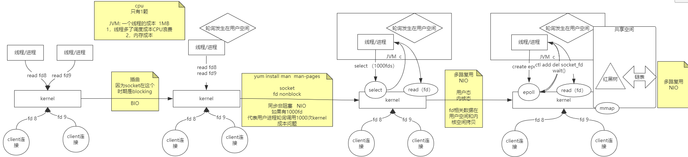
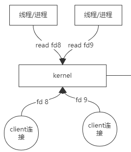
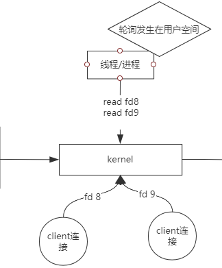
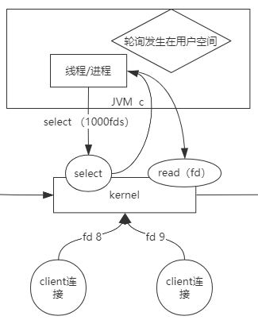
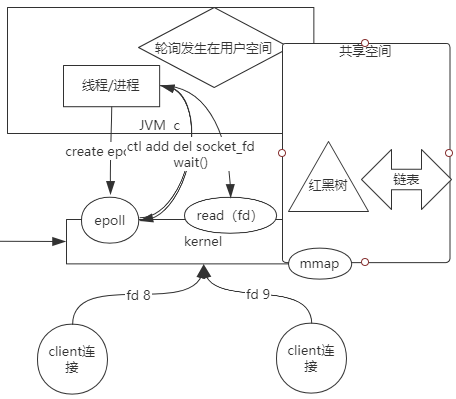

## IO模型演化



### 1.BIO

```text
JVM: 一个线程的成本  1MB
1，线程多了调度成本CPU浪费
2，内存成本
```




### 2.同步非阻塞NIO

```text
同步非阻塞   NIO
如果有1000fd
代表用户进程轮询调用1000次kernel
成本问题
```




线程换1000个fd到内核查，内核返回可read的fd

```text
fd相关数据在用户空间和内核空间拷贝
粒度不够细
```



### 3.多路复用epoll

epoll的三个调用
```c
int epoll_create(int size);  // 创建一个epoll的句柄,
int epoll_ctl(int epfd, int op, int fd, struct epoll_event *event); //epoll的事件注册函数，它不同于select()是在监听事件时告诉内核要监听什么类型的事件，而是在这里先注册要监听的事件类型
int epoll_wait(int epfd, struct epoll_event * events, int maxevents, int timeout); // 收集在epoll监控的事件中已经发送的事件
```

内核空间做共享空间的增删改操作，内核和用户空间都可以查共享空间


