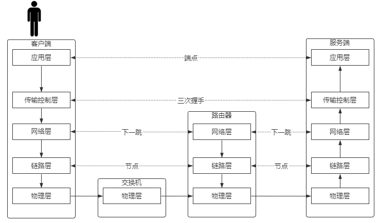
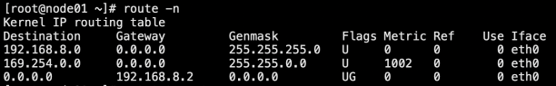
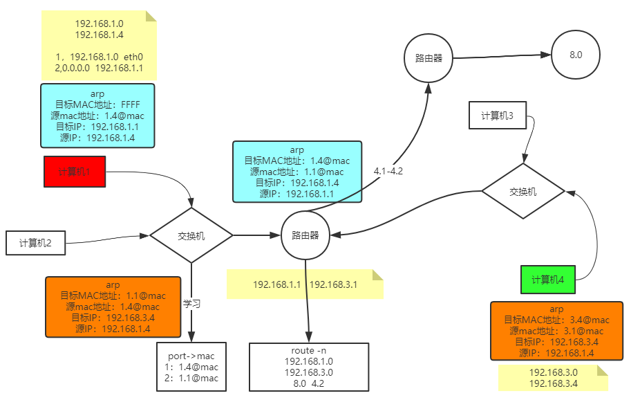
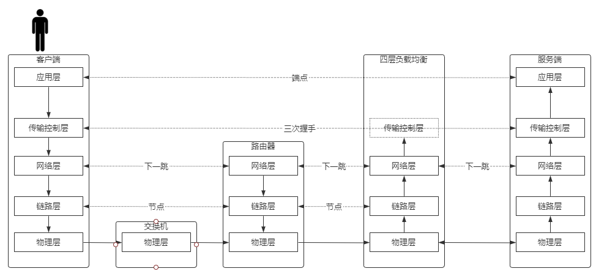
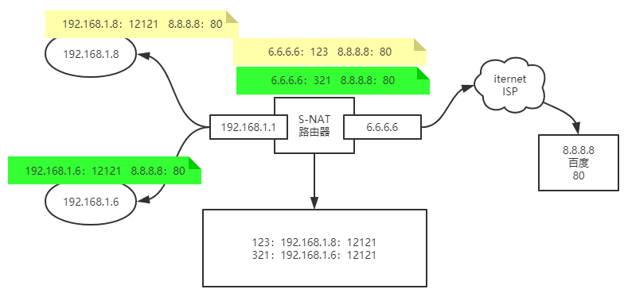
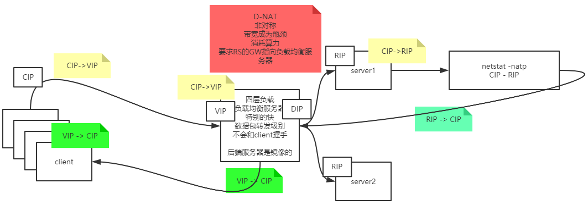
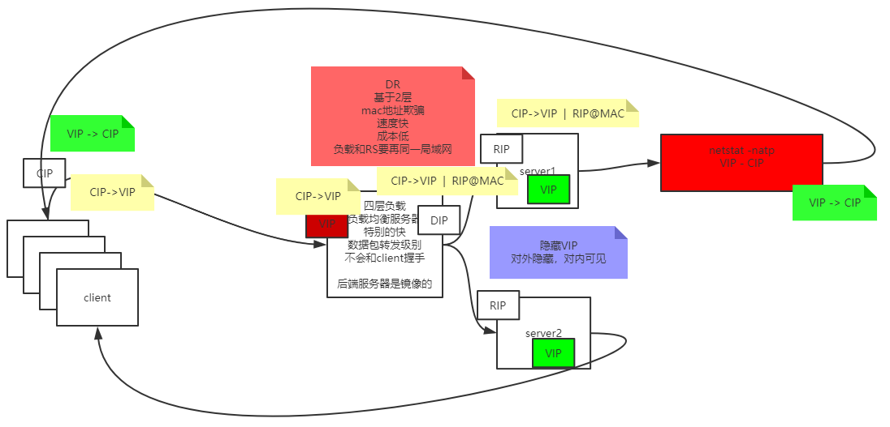
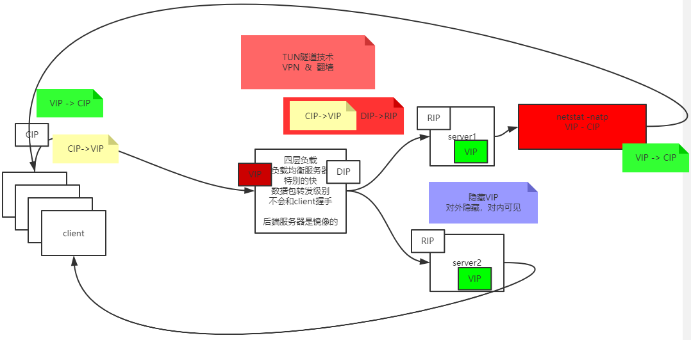

## 建立连接

如何寻址：
```text
源端口号->目标端口号 - 和目标服务器哪个端口通信
源IP地址->目标IP地址 - 找到目标服务器
源MAC地址->目标MAC地址 - 找到下一跳
```

```text
结论：
TCP/IP协议：
基于下一跳的机制：
IP是端点间
mac地址是节点间的
```

```text
三次握手>数据传输>四次分手
成为一个最小粒度
不可被分割
```



### 建立连接-传输数据


### 网络层下一跳机制

数据包是下一跳的MAC地址和目标的ip，每跳一次，源/目标MAC地址都会变

```text
route -n
路由判定
按位与
```



### 找到下一跳节点的MAC地址

ARP（Address Resolution Protocol）是一个重要的TCP/IP协议，并且用于确定对应IP地址的网卡物理地址


### 示例




## 四层负载均衡

```text
客户端去连服务器
客户端不和负载均衡握手

```



### NAT 模型

路由器修改的是源地址(S-NAT)




修改目标地址 D-NAT

基于D-NAT的负载均衡（3-4层，网络层）

缺陷
```text
非对称(客户端请求内容少，服务端返回内容多)
带宽成为瓶颈
消耗算力(RIP->DIP转换)
要求RS的GW指向负载均衡服务器
```


### DR 模型

基于DR(direct route，直接路由模型)的负载均衡（2层链路层）

```text
DR
基于2层
mac地址欺骗
速度快
成本低
负载和RS要再同一局域网
```



### TUN 模型

```text
TUN隧道技术
VPN  &  翻墙
```


