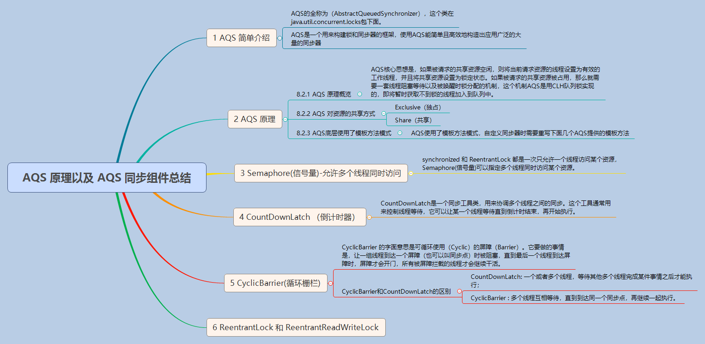

## 请谈一下AQS,为什么AQS的底层是CAS+volatile

> CAS+volatile的使用既保证了这个变量的可见性，又能在存在竞争的时候线程安全地获取资源，虽然volatile修改存在并发安全问题，但是用CAS可以避免这个问题。

> 至于什么时候不用synchronized而是CAS+volatile非阻塞乐观锁？应该在synchronized的阻塞造成了系统性能的瓶颈的时候，因为CAS+volatile的编写更加复杂

AQS（AbstratctQueuedSynchronizer）简单来说就是有一个当前工作线程并且维护一个被锁定的线程队列，并且实现独占锁或者是共享锁。

AQS是一个抽象类的同步器，使用了模板方法的设计模式，也就是在抽象类AQS中定义算法的骨架，然后具体的子类需要重写AQS的一些方法，这样就能实现不同场景所需要的同步器。

ReetrantLock,ReentrantReadWriteLock等很多锁都是基于AQS实现的。



## AQS源码分析

### 数据结构

```$xslt
        static final Node SHARED = new Node();//共享模式的标记
        static final Node EXCLUSIVE = null;//独占模式的标志
        static final int CANCELLED =  1;//表明线程已经取消
        /** waitStatus value to indicate successor's thread needs unparking */
        static final int SIGNAL    = -1;
        //一种线程等待状态，需要工作线程唤醒
        /** waitStatus value to indicate thread is waiting on condition */
        static final int CONDITION = -2;//一种等待状态，表明线程有条件性等待
        /**
         * waitStatus value to indicate the next acquireShared should
         * unconditionally propagate
         */
        static final int PROPAGATE = -3;

        /**
         * Status field, taking on only the values:状态域，包括以下值
         *   SIGNAL:     * 这个节点的继任者被阻塞（通过park)，所以当前线程当释放或者取消的时候必须要唤醒它的继任者
         为了避免竞争，获取方法需要先表明signal，然后原子性获取。失败之后进入bolck状态
         *   CANCELLED: 
         这个节点由于超时或者中断被取消。节点不释放它的资源。尤其，一个个被取消的节点不会再一次blocks
         *   CONDITION:  
         这个节点当前在一个条件等待队列
         *   PROPAGATE: 
         非负表明节点不需要唤醒。所以，大多数代码不需要检查特点值，只是用来标记
         
         这个参数初始化为0
         condition会初始化为CONDITION，通过CAS修改值，或者无条件地volatile写**/
        volatile int waitStatus;

       
         /*当前工作线程的前继线程
         由于head线程总是不取消，所以一个节点只能通过aquire获取。一个取消的线程不能aquire。一个线程总是自我取消，而不是其他节点来取消*/
        volatile Node prev;

      
        volatile Node next;

    
         /*入队的线程.构造函数初始化，使用后置为null*/
        volatile Thread thread;
        Node nextWaiter;

```
* waitStatus表示当前被封装成Node结点的等待状态，共有4种取值CANCELLED、SIGNAL、CONDITION、PROPAGATE。
  
    1. CANCELLED
    
    >值为1，在同步队列中等待的线程等待超时或被中断，需要从同步队列中取消该Node的结点，其结点的waitStatus为CANCELLED，即结束状态，进入该状态后的结点将不会再变化。
    
    2. SIGNAL
    
    >值为-1，被标识为该等待唤醒状态的后继结点，当其前继结点的线程释放了同步锁或被取消，将会通知该后继结点的线程执行。说白了，就是处于唤醒状态，只要前继结点释放锁，就会通知标识为SIGNAL状态的后继结点的线程执行。
    
    3.CONDITION
    
    >值为-2，与Condition相关，该标识的结点处于等待队列中，结点的线程等待在Condition上，当其他线程调用了Condition的signal()方法后，CONDITION状态的结点将从等待队列转移到同步队列中，等待获取同步锁。
    
    4. PROPAGATE
    
    >值为-3，与共享模式相关，在共享模式中，该状态标识结点的线程处于可运行状态。

    5. 0状态
    
    >值为0，代表初始化状态。


```$xslt
/**
     等待队列头节点，除了初始化，通过setHead修改。注意：如果头存在，它的等待状态不能是CANCELLED.
     */
    private transient volatile Node head;

    /**
     尾节点，通过enq方法添加新的等待节点
     */
    private transient volatile Node tail;

    /**
     * 资源state.
     */
    private volatile int state;

```
AQS维护着一个队列，维护着共享资源的访问如下


