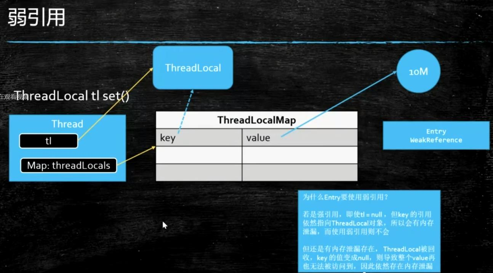
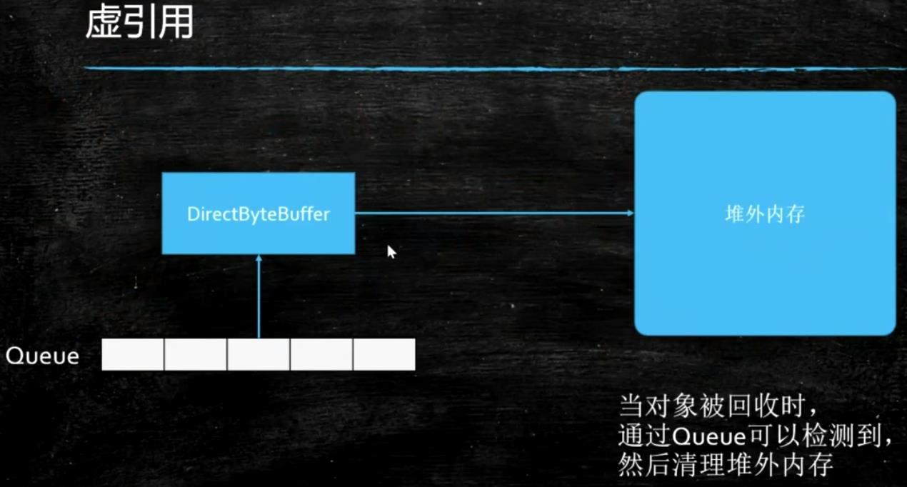
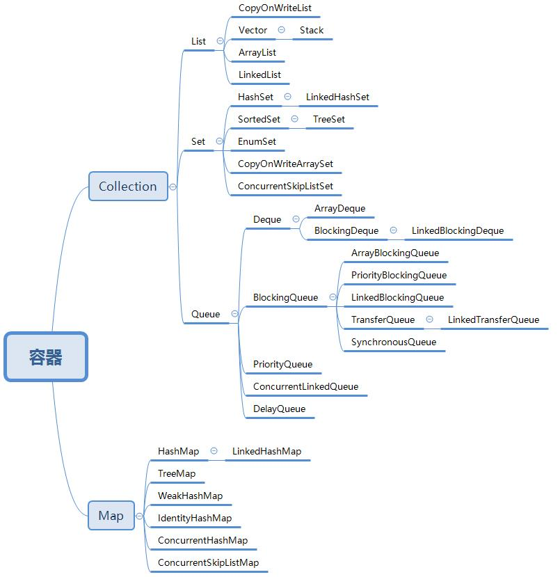

# 多线程与高并发


## 基础概念

纤程

## JUC

* ConcurrentHashMap 和LongAdder都是分段锁

* CountDownLatch 和 join区别

>join要等一个线程执行完再执行另一个

* CountDownLatch和CyclicBarrier都能够实现线程之间的等待，只不过它们侧重点不同：

> CountDownLatch一般用于某个线程A等待若干个其他线程执行完任务之后，它才执行；

> 而CyclicBarrier一般用于一组线程互相等待至某个状态，然后这一组线程再同时执行；

> 另外，CountDownLatch是不能够重用的，而CyclicBarrier是可以重用的。

* Phaser

> 分阶段的CyclicBarrier

* Semaphore

> 阀门，类似于车道(线程池)和收费站(semaphore)

```$xslt
 用于获取权限的acquire(),其底层实现与CountDownLatch.countdown()类似;
 用于释放权限的release()，其底层实现与acquire()是一个互逆的过程。
```


* ReadWriteLock , StampedLock

> 排他锁

* Exchanger

> 线程间交换数据

* LockSupport

```$xslt
t1 t2两个线程
LockSupport.unpart(t2); //唤醒t2
LockSupport.part(); //t1阻塞

```


## AQS源码 

* jdk9 - java.lang.invoke.VarHandle 

比反射快直接操作二进制码

普通属性也能变成原子操作

## ThreadLocal

* 用途

```
声明式事务，保证是同一个connection
```


使用完需要remove，否则仍然会内存泄露

## 四种引用

* SoftReference 空间不够才会被回收，做缓存

* WeakReference  ThreadLocal



* 虚引用 PhantomReference

管理堆外内存

遭遇gc就被回收



## 同步容器



* DelayQueue

* SynchronousQueue  容量为0

* TransferQueue 


## 线程池

* ThreadPoolExecutor

* ForkJoinPool

java8 parallelStream使用的这个

## 高频面试加分项

线程顺序执行控制

## Disruptor (单机环境上效率最高的MQ)


## 面试题 1

实现一个容器，提供两个方法: add, size

写两个线程，线程1添加10个元素到容器中，线程2实现监控元素的个数，当个数到5个时，线程2给出提示并结束

> 类似让两个线程交替输出

## 面试题2

写一个固定容量同步容器，拥有put和get方法，以及getCount方法，
能够支持2个生产者线程以及10个消费者线程的阻塞调用


