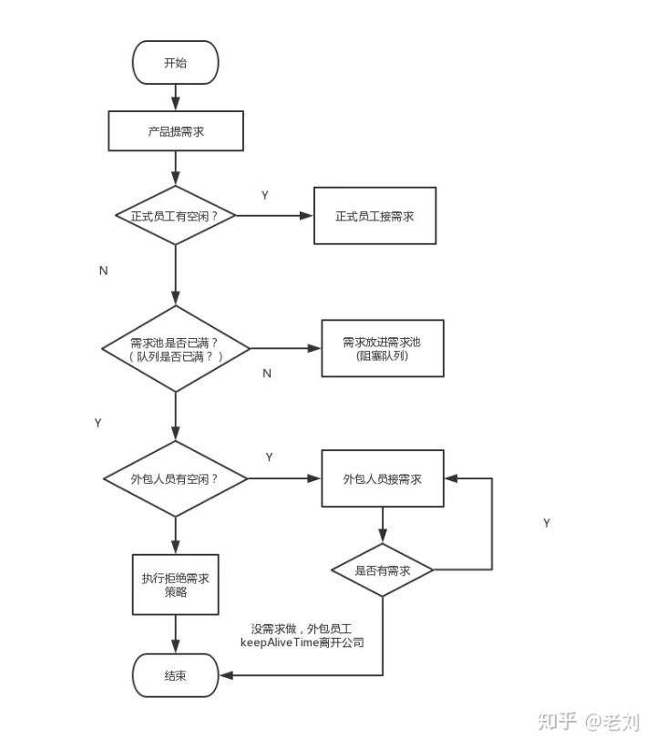

##经典面试题
  
1. Java的线程池说一下，各个参数的作用，如何进行的?
2. 按线程池内部机制，当提交新任务时，有哪些异常要考虑。
3. 线程池都有哪几种工作队列？
4. 使用无界队列的线程池会导致内存飙升吗？
5. 说说几种常见的线程池及使用场景?

##ThreadPoolExecutor

```$xslt
public (int corePoolSize,
                          int maximumPoolSize,
                          long keepAliveTime,
                          TimeUnit unit,
                          BlockingQueue<Runnable> workQueue,
                          ThreadFactory threadFactory,
                          RejectedExecutionHandler handler);

```

1. corePoolSize，线程池中的核心线程数，即便是线程池里没有任何任务，也会有corePoolSize个线程在候着等任务。
2. maximumPoolSize，线程池中的最大线程数，不管你提交多少任务，线程池里最多工作线程数就是maximumPoolSize。
3. keepAliveTime，空闲时间，当线程池数量超过核心线程数时，多余的空闲线程存活的时间，即：这些线程多久被销毁。
4. unit，空闲时间的单位，可以是毫秒、秒、分钟、小时和天，等等
5. workQueue，等待队列，线程池中的线程数超过核心线程数时，任务将放在等待队列，它是一个BlockingQueue类型的对象
6. threadFactory，线程工厂，用来创建线程，主要是为了给线程起名字，默认工厂的线程名字：pool-1-thread-3。
7. handler，拒绝策略，当线程池和等待队列都满了之后，需要通过该对象的回调函数进行回调处理



###workQueue
等待队列是BlockingQueue类型的，理论上只要是它的子类，我们都可以用来作为等待队列。

同时，jdk内部自带一些阻塞队列，我们来看看大概有哪些。

    ArrayBlockingQueue，队列是有界的，基于数组实现的阻塞队列
    LinkedBlockingQueue，队列可以有界，也可以无界。基于链表实现的阻塞队列
    SynchronousQueue，不存储元素的阻塞队列，每个插入操作必须等到另一个线程调用移除操作，否则插入操作将一直处于阻塞状态。该队列也是Executors.newCachedThreadPool()的默认队列
    PriorityBlockingQueue，带优先级的无界阻塞队列

### 拒绝策略-handler
   
所谓拒绝策略，就是当线程池满了、队列也满了的时候，我们对任务采取的措施。或者丢弃、或者执行、或者其他...
   
   jdk自带4种拒绝策略:
   
       CallerRunsPolicy // 在调用者线程执行
       AbortPolicy // 直接抛出RejectedExecutionException异常
       DiscardPolicy // 任务直接丢弃，不做任何处理
       DiscardOldestPolicy // 丢弃队列里最旧的那个任务，再尝试执行当前任务

## 拒绝策略使用场景


## 已实现的线程池
```
// 创建单一线程的线程池
public static ExecutorService newSingleThreadExecutor();
```


```$xslt
// 创建固定数量的线程池
public static ExecutorService newFixedThreadPool(int nThreads);
```

```$xslt
// 创建带缓存的线程池
public static ExecutorService newCachedThreadPool();
```

```$xslt
// 创建定时调度的线程池
public static ScheduledExecutorService newScheduledThreadPool(int corePoolSize);
```

```
// 创建流式（fork-join）线程池
public static ExecutorService newWorkStealingPool();
```


## 阿里为什么不允许使用默认线程池

创建线程或线程池时请指定有意义的线程名称，方便出错时回溯

线程池不允许使用Executors去创建，而是通过ThreadPoolExecutor的方式，这样的处理方式让写的同学更加明确线程池的运行规则，规避资源耗尽的风险。 

说明：Executors返回的线程池对象的弊端如下： 
1. FixedThreadPool和SingleThreadPool: 
    
> 允许的请求队列长度为Integer.MAX_VALUE，可能会堆积大量的请求，从而导致OOM。 

2. CachedThreadPool和ScheduledThreadPool: 
    
>允许的创建线程数量为Integer.MAX_VALUE，可能会创建大量的线程，从而导致OOM


## ForkJoinPool 

java8 parallelStream使用这个线程池
