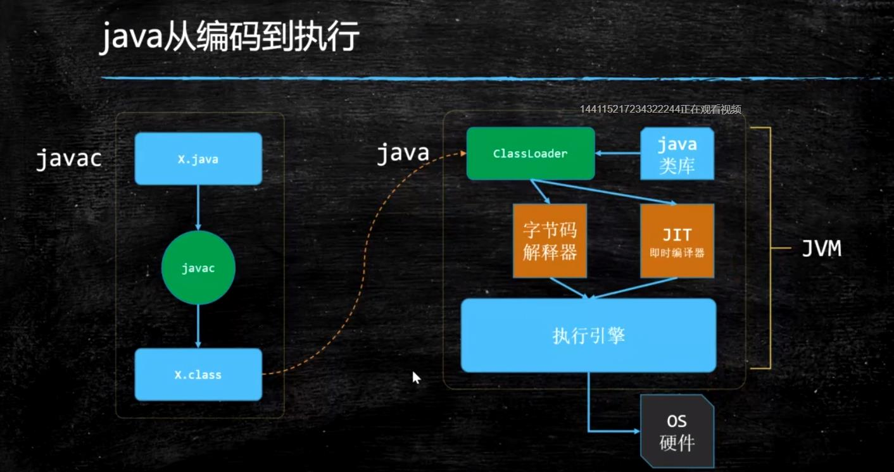

## Java从编码到执行



## 1：JVM基础知识

1. 什么是JVM
2. 常见的JVM

## 2：ClassFileFormat

### JVM指令

* 只有八个指令是原子的

```
lock(锁定)：作用于主内存，它把一个变量标记为一条线程独占状态；
read(读取)：作用于主内存，它把变量值从主内存传送到线程的工作内存中，以便随后的load动作使用；
load(载入)：作用于工作内存，它把read操作的值放入工作内存中的变量副本中；
use(使用)：作用于工作内存，它把工作内存中的值传递给执行引擎，每当虚拟机遇到一个需要使用这个变量的指令时候，将会执行这个动作；
assign(赋值)：作用于工作内存，它把从执行引擎获取的值赋值给工作内存中的变量，每当虚拟机遇到一个给变量赋值的指令时候，执行该操作；
store(存储)：作用于工作内存，它把工作内存中的一个变量传送给主内存中，以备随后的write操作使用；
write(写入)：作用于主内存，它把store传送值放到主内存中的变量中。
unlock(解锁)：作用于主内存，它将一个处于锁定状态的变量释放出来，释放后的变量才能够被其他
```

## 3：类编译-加载-初始化

hashcode
锁的信息（2位 四种组合）
GC信息（年龄）
如果是数组，数组的长度

## 4：JMM

new Cat()
pointer -> Cat.class
寻找方法的信息

## 5：对象

1：句柄池 （指针池）间接指针，节省内存
2：直接指针，访问速度快

## 6：GC基础知识

栈上分配
TLAB（Thread Local Allocation Buffer）
Old
Eden
老不死 - > Old

## 7：GC常用垃圾回收器

new Object()
markword          8个字节
类型指针           8个字节
实例变量           0
补齐                  0		
16字节（压缩 非压缩）
Object o
8个字节 
JVM参数指定压缩或非压缩

