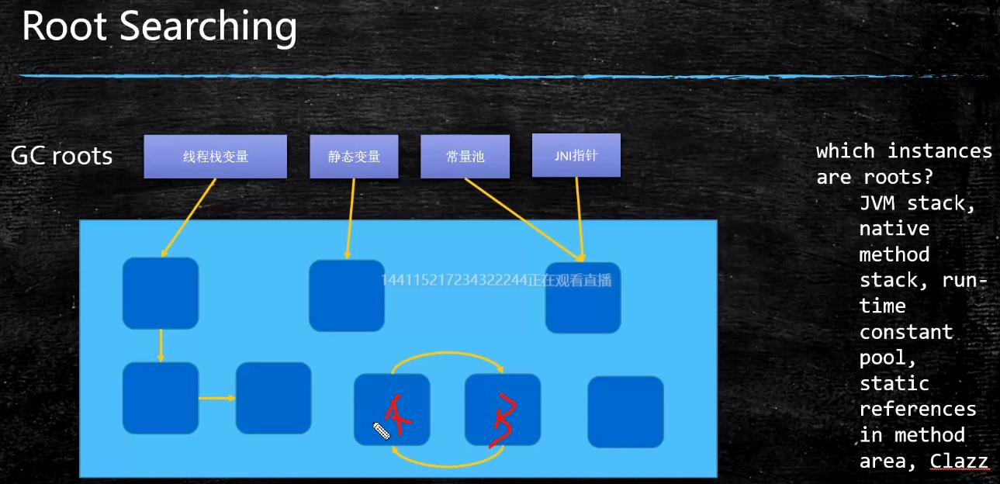
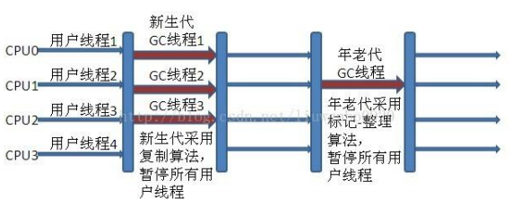
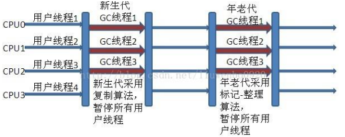
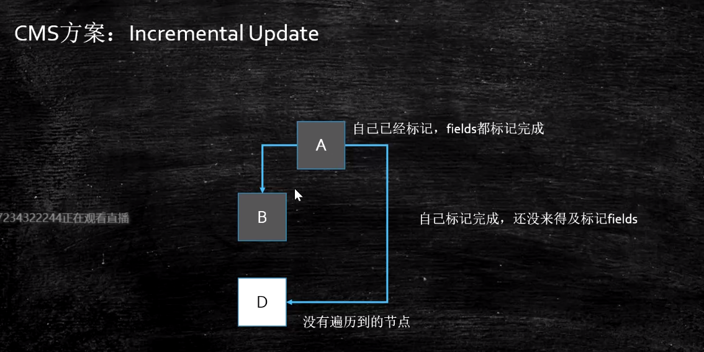
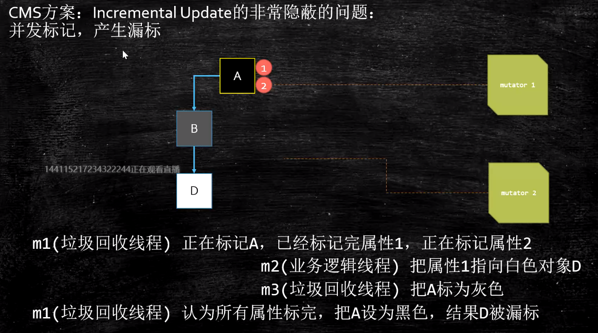
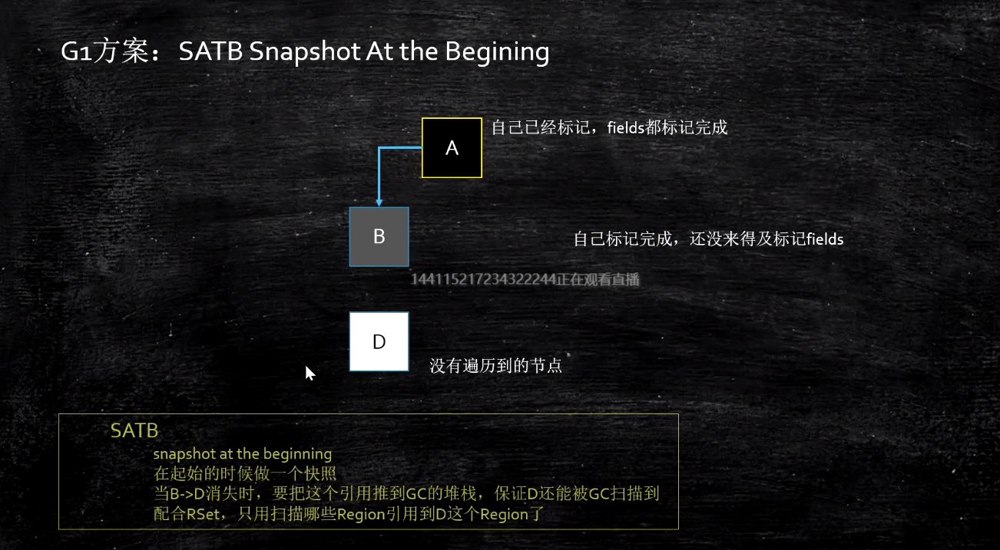

## 可达性

# GC分代收集算法  VS 分区收集算法 

## 分代收集算法

当前主流VM垃圾收集都采用”分代收集”(Generational Collection)算法, 这种算法会根据对象存活周期的不同将内存划分为几块, 如JVM中的 新生代、老年代、永久代，这样就可以根据各年代特点分别采用最适当的GC算法 

### 在新生代-复制算法 

每次垃圾收集都能发现大批对象已死, 只有少量存活. 因此选用复制算法, 只需要付出少量存活对象的复制成本就可以完成收集. 

### 在老年代-标记整理算法 
因为对象存活率高、没有额外空间对它进行分配担保, 就必须采用“标记—清理”或“标记—整理”算法来进行回收, 不必进行内存复制, 且直接腾出空闲内存. 

## 分区收集算法 

分区算法则将整个堆空间划分为连续的不同小区间, 每个小区间独立使用, 独立回收. 这样做的好处是可以控制一次回收多少个小区间 , 根据目标停顿时间, 每次合理地回收若干个小区间(而不是整个堆), 从而减少一次GC所产生的停顿。 

# GC垃圾收集器

## Serial垃圾收集器（单线程、复制算法）

Serial（英文连续）是最基本垃圾收集器，使用复制算法，曾经是JDK1.3.1之前新生代唯一的垃圾收集器。Serial是一个单线程的收集器，它不但只会使用一个CPU或一条线程去完成垃圾收集工作，并且在进行垃圾收集的同时，必须暂停其他所有的工作线程，直到垃圾收集结束。 
Serial垃圾收集器虽然在收集垃圾过程中需要暂停所有其他的工作线程，但是它简单高效，对于限定单个CPU环境来说，没有线程交互的开销，可以获得最高的单线程垃圾收集效率，因此Serial垃圾收集器依然是java 虚拟机运行在Client模式下默认的新生代垃圾收集器。 

## ParNew垃圾收集器（Serial+多线程） 

ParNew垃圾收集器其实是Serial收集器的多线程版本，也使用复制算法，除了使用多线程进行垃圾收集之外，其余的行为和Serial收集器完全一样，ParNew垃圾收集器在垃圾收集过程中同样也要暂停所有其他的工作线程。 
ParNew收集器默认开启和CPU数目相同的线程数，可以通过-XX:ParallelGCThreads参数来限制垃圾收集器的线程数。【Parallel：平行的】 
ParNew虽然是除了多线程外和Serial收集器几乎完全一样，但是ParNew垃圾收集器是很多java虚拟机运行在Server模式下新生代的默认垃圾收集器。 

## Parallel Scavenge收集器（多线程复制算法、高效） 

Parallel  Scavenge收集器也是一个新生代垃圾收集器，同样使用复制算法，也是一个多线程的垃圾收集器，它重点关注的是程序达到一个可控制的吞吐量（Thoughput，CPU用于运行用户代码的时间/CPU 总消耗时间，即吞吐量=运行用户代码时间/(运行用户代码时间+垃圾收集时间)），高吞吐量可以最高效率地利用CPU时间，尽快地完成程序的运算任务，主要适用于在后台运算而不需要太多交互的任务。自适应调节策略也是ParallelScavenge收集器与ParNew收集器的一个重要区别。 

## Serial Old收集器（单线程标记整理算法 ）

Serial  Old是Serial垃圾收集器年老代版本，它同样是个单线程的收集器，使用标记-整理算法，这个收集器也主要是运行在Client默认的java 虚拟机默认的年老代垃圾收集器。 
在Server模式下，主要有两个用途： 

* 在JDK1.5之前版本中与新生代的Parallel Scavenge收集器搭配使用。 
* 作为年老代中使用CMS收集器的后备垃圾收集方案。 

新生代Serial与年老代Serial Old搭配垃圾收集过程图： 

新生代Parallel Scavenge收集器与ParNew收集器工作原理类似，都是多线程的收集器，都使用的是复制算法，在垃圾收集过程中都需要暂停所有的工作线程。

新生代Parallel Scavenge/ParNew与年老代Serial Old搭配垃圾收集过程图： 

## Parallel Old收集器（多线程标记整理算法） 

Parallel Old收集器是Parallel Scavenge的年老代版本，使用多线程的标记-整理算法，在JDK1.6才开始提供。

在JDK1.6之前，新生代使用ParallelScavenge收集器只能搭配年老代的Serial  Old收集器，只能保证新生代的吞吐量优先，无法保证整体的吞吐量，Parallel  Old正是为了在年老代同样提供吞吐量优先的垃圾收集器，如果系统对吞吐量要求比较高，可以优先考虑新生代Parallel  Scavenge和年老代Parallel Old收集器的搭配策略。 

新生代Parallel Scavenge和年老代Parallel Old收集器搭配运行过程图： 

## CMS收集器（多线程标记清除算法） 
Concurrent  mark  sweep(CMS)收集器是一种年老代垃圾收集器，其最主要目标是获取最短垃圾回收停顿时间，和其他年老代使用标记-整理算法不同，它使用多线程的标记-清除算法。 最短的垃圾收集停顿时间可以为交互比较高的程序提高用户体验。  

CMS工作机制相比其他的垃圾收集器来说更复杂，整个过程分为以下4个阶段： 

* 初始标记 

>只是标记一下GC Roots能直接关联的对象，速度很快，仍然需要暂停所有的工作线程(STW)。 

* 并发标记 

>进行GC Roots跟踪的过程，和用户线程一起工作，不需要暂停工作线程。 

* 重新标记 

>为了修正在并发标记期间，因用户程序继续运行而导致标记产生变动的那一部分对象的标记记录，仍然需要暂停所有的工作线程(STW)。 

* 并发清除 

>清除GC Roots不可达对象，和用户线程一起工作，不需要暂停工作线程。由于耗时最长的并发标记和并发清除过程中，垃圾收集线程可以和用户现在一起并发工作，所以总体上来看CMS收集器的内存回收和用户线程是一起并发地执行。 

CMS收集器工作过程： 

## G1收集器 
Garbage  first垃圾收集器是目前垃圾收集器理论发展的最前沿成果，相比与CMS收集器，G1收集器两个最突出的改进是： 

* 基于标记-整理算法，不产生内存碎片。 
* 可以非常精确控制停顿时间，在不牺牲吞吐量前提下，实现低停顿垃圾回收。

G1收集器避免全区域垃圾收集，它把堆内存划分为大小固定的几个独立区域，并且跟踪这些区域的垃圾收集进度，同时在后台维护一个优先级列表，每次根据所允许的收集时间，优先回收垃圾最多的区域。区域划分和优先级区域回收机制，确保G1收集器可以在有限时间获得最高的垃圾收集效率。 

### Region

堆仍然有新生代(eden、survivor)、老年代的划分，但是不再要求它们是内存连续的。每个区都由多个Region组成。
部分老年代Region存储Humongous对象(即下图的H)，这种对象大小大于等于Region的一半。

G1收集器工作过程：

* 初始标记（Initial Mark）

>标记GC root能直接关联的对象（短暂STW）

* 并发标记（Concurrent mark）

>GCRootsTracing，从并发标记中的root遍历，对不可达的对象进行标记，耗时长但可并行

* 最终标记（Final Remark）

>收集并发标记期间产生的新垃圾（短暂STW）,采用了SATB算法比CMS更快

* 筛选回收（Live Data Counting and Evacuation）

> 对各个Region的回收性价比排序，在保证时间可控的情况下清除失活对象，清除Remember Sets

G1收集器工作过程： 

# CMS与G1的区别

CMS和G1的算法都是通过对gc root 进行遍历，并进行三色标记。标记规则为

    黑色(black): 节点被遍历完成，而且子节点都遍历完成。
    灰色(gray): 当前正在遍历的节点，而且子节点（即对象的域）还没有遍历。遍历完所有子节点后，将成为黑色
    白色(white): 还没有遍历到的节点，即灰色节点的子节点。扫描结束仍是白色时会被回收。

CMS的incremental update设计使得它在remark阶段必须重新扫描所有线程栈和整个young gen作为root

并且有漏标的可能

G1 RSet 全称Remember Set，记录一个Region里的对象被哪些其他Region引用。
相对应地，有另一种辅助数据结构Collection Set（CSet），它记录了GC要收集的Region集合。GC时只需扫描CSet中各个Rset即可。

## G1的YGC

> JVM启动时，G1先准备好Eden区，程序在运行过程中不断创建对象到Eden区，当所有的Eden区都满了，G1会启动一次年轻代垃圾回收过程。年轻代只会回收Eden区和Survivor区

## G1的MixedGC

YGC,对象特别多，堆内存整体占用默认值到45%了就触发了

相当于CMS  初始标记-并发标记-最终标记(重新标记)-筛选回收

## G1的FGC

用的是serial，所以要尽量少FGC，要让mixedGC提前到来

JAVA 10以前是串行，后面是并行

## G1与CMS相比的优势

* 并发度更高，充分利用CPU多线程 —— CMS对CPU资源敏感，需要占用25%的线程，如果核数小于4更会占用一半的资源。
* 整体上是标记-整理(分代)，局部是复制(分Region)，运行期不产生碎片 —— CMS是标记-清除，会产生空间碎片和本次回收期间产生导致本次无法回收的浮动垃圾
* 可预测的停顿(基于Region)

# 三色标记法

## incremental update 和SATB

* incremental update 

增量更新，关注的是引用的增加。把黑色重新标记为灰色，下次重新扫描属性

* SATB

关注引用的删除，当B->D消失时，要把这个引用推到GC的堆栈，保证D还能被GC扫描到，和RSet相互配合。

灰色->白色 引用消失时，如果没有黑色指向白色，引用会被push到堆栈，下次扫描时拿到这个引用，由于有RSet，
不需要扫描整个堆去查找指向白色引用，效率比较高，SATB配合RSet

# ZGC颜色指针

2^42=4T

最大 2^44=16T 因为目前数据总线最宽是48位

## 位数定义：

> 而CPU的位宽一般是以 min{ALU位宽、通用寄存器位宽、数据总线位宽}决定的！也就是说CPU由ALU(算术逻辑单元(arithmetic and logic unit) 是能实现多组算术运算和逻辑运算的组合逻辑电路，简称ALU)、通用寄存器、数据总线三者之中最少的位宽决定！所以CPU位宽与其寻址能力并不是挂钩的！
  目前的64位处理器一般可以达到48位寻址，也就是48条地址总线。
