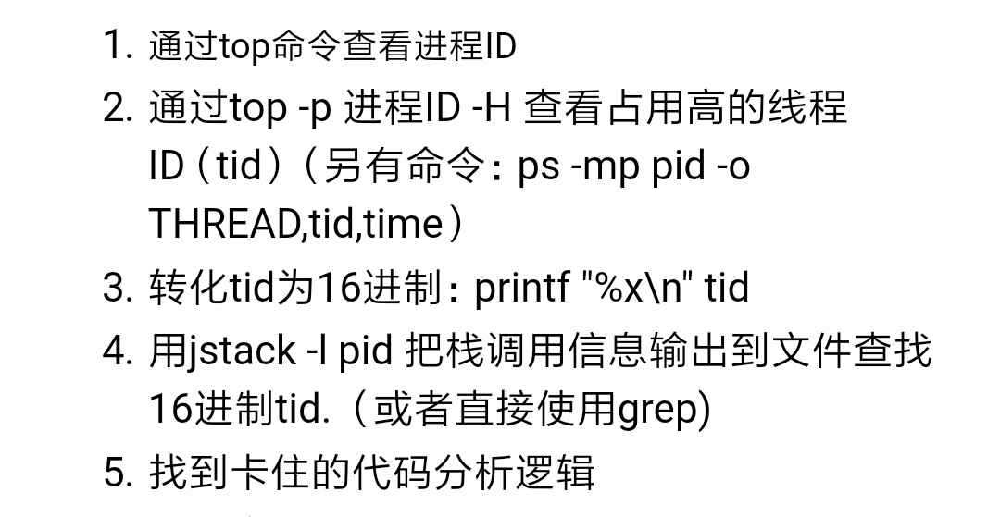

## jstack使用

-XX:+PrintGC

## 定位问题

* jps 

> 查看java进程

* jinfo PID 

> 打印进程相关信息

* jstat -gc PID [间隔多少秒刷新一次]

* jstack PID

> 列出进程的所有线程，一般用来发现有没有死锁,CPU飙高

要看是GC的线程导致，还是业务线程导致

* jmap 

在测试环境使用

查看那些对象在占内存，会导致堆暂停

jmap -histo pid | head -20

怀疑哪些类，再使用arthas

* arthas 

thread 查CPU飙高

thread -b 查死锁
 
 heapdump /tmp/dump.hprof
 
 redefine 热部署
 
 
 * 

