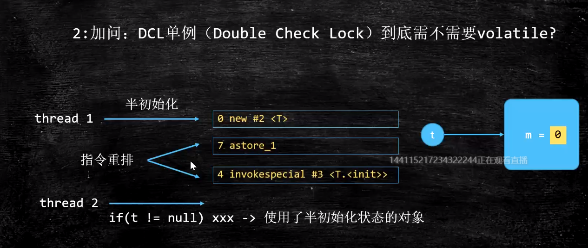

# 关于Object o = new Object()

## 请解释一下对象的创建过程

1. 申请内存空间（半初始化）
2. 成员变量设为初始值
3. o指向对象

## DCL与volatile问题



## 对象在内存中的存储布局


## 对象头具体包括什么
markword klasspointer synchronized锁信息 hashcode 分代年龄


>轻量级锁和重量级锁时中间62位没有了，他们被保存在线程栈的Lock Record中了

```$xslt
|-------------------------------------------------------|--------------------|
|                  Mark Word (32 bits)                  |       State        |
|-------------------------------------------------------|--------------------|
| identity_hashcode:25 | age:4 | biased_lock:1 | lock:2 |       Normal       |
|-------------------------------------------------------|--------------------|
|  thread:23 | epoch:2 | age:4 | biased_lock:1 | lock:2 |       Biased       |
|-------------------------------------------------------|--------------------|
|               ptr_to_lock_record:30          | lock:2 | Lightweight Locked |
|-------------------------------------------------------|--------------------|
|               ptr_to_heavyweight_monitor:30  | lock:2 | Heavyweight Locked |
|-------------------------------------------------------|--------------------|
|                                              | lock:2 |    Marked for GC   |
|-------------------------------------------------------|--------------------|
```
```$xslt
|------------------------------------------------------------------------------|--------------------|
|                                  Mark Word (64 bits)                         |       State        |
|------------------------------------------------------------------------------|--------------------|
| unused:25 | identity_hashcode:31 | unused:1 | age:4 | biased_lock:1 | lock:2 |       Normal       |
|------------------------------------------------------------------------------|--------------------|
| thread:54 |       epoch:2        | unused:1 | age:4 | biased_lock:1 | lock:2 |       Biased       |
|------------------------------------------------------------------------------|--------------------|
|                       ptr_to_lock_record:62                         | lock:2 | Lightweight Locked |
|------------------------------------------------------------------------------|--------------------|
|                     ptr_to_heavyweight_monitor:62                   | lock:2 | Heavyweight Locked |
|------------------------------------------------------------------------------|--------------------|
|                                                                     | lock:2 |    Marked for GC   |
|------------------------------------------------------------------------------|--------------------|

```

## 对象怎么定位

* 句柄访问

> 通过一个间接指针，该间接指针包含两个指针，一个指向真正的对象，另一个指向T.class。将classPointer单独拎出来了


* 直接访问

> o直接指向对象，然后对象再去指向Object.class，这两种无优劣之分。

HotSpot采用第二种直接指针的方式，效率高些，但在GC时，第一种效率更高。

## 对象怎么分配
栈上-线程本地-Eden-Old

TLAB: thread local allocation buffer


对象在新生代最多存活多少次：PS,PO-15(因为对象头只有4bit存年龄信息)，CMS回收器：6

## Object o = new Object()在内存中占用多少字节
指针在32位jdk中占用4字节，64位jdk是8字节，如果UseCompressedOops被打开了，则一个指针仍然是4个字节

根据对象在内存中的存储布局,一个对象由对象头(markword, class pointer)，对象实例数据，以及对齐填充（可能存在）三部分组成
