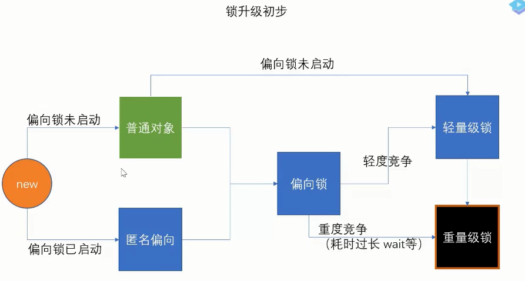

## 线程状态


## 用户态与内核态

0x80中断

## 为什么不能用String, Integer, Long等对象加锁

为啥锁对象最好使final的，但是又不让string做锁

## 锁与异常

如果出现异常，默认情况锁会被释放

> 比如web app中，多个servlet线程共同访问一个资源，如果异常处理不合适，在第一个线程
抛出了异常，其他线程会进入同步代码区，可能访问到异常产生的数据

## 请描述synchronized和reentrantlock的底层实现及重入的底层原理

## 请描述锁的四种状态和升级过程



* 偏向锁 偏向第一个线程 对象头记录了线程id

* 轻量锁 自旋锁 CAS ： 线程用清凉锁

* 重量锁： 线程多用重量锁，操作时间长用重量锁

## 锁细化和粗化

细化：只加到必要的方法上

粗化：各个小方法全是锁，不如直接放到一个方法

## CAS的ABA问题如何解决

* CAS原理

>CAS机制当中使用了3个基本操作数：内存地址V，旧的预期值A，要修改的新值B。更新一个变量的时候，只有当变量的预期值A和内存地址V当中的实际值相同时，才会将内存地址V对应的值修改为B。

* CAS缺点：

    1. CPU开销较大，多线程反复尝试更新某一个变量的时候容易出现；
    2. 不能保证代码块的原子性，只能保证变量的原子性操作；
    3. ABA问题。

 *ABA解决

 > ABA问题的解决思路就是使用版本号。在变量前面追加上版本号，每次变量更新的时候把版本号加一，那么A－B－A 就会变成1A-2B－3A。 

 >从Java1.5开始JDK的atomic包里提供了一个类AtomicStampedReference来解决ABA问题。这个类的compareAndSet方法作用是首先检查当前引用是否等于预期引用，并且当前标志是否等于预期标志，如果全部相等，则以原子方式将该引用和该标志的值设置为给定的更新值。

## 请谈一下你对volatile的理解  

1. 变量对其他线程可见 

2. 禁止指令重排序


* volatile语义可见性+有序性，但不能保证并发安全，使用场景：

    (1)对变量的写操作不依赖于当前值。
    (2)该变量没有包含在具有其他变量的不变式中。


## volatile VS synchronized

volatile 汇编锁的是一个空指令（lock addl 0到寄存器），synchronized锁的是一个cas(lock cmpexchange)

* volatile本质是在告诉jvm当前变量在寄存器（工作内存）中的值是不确定的，需要从主存中读取； synchronized则是锁定当前变量，只有当前线程可以访问该变量，其他线程被阻塞住。
* volatile仅能使用在变量级别；synchronized则可以使用在变量、方法、和类级别的
* volatile仅能实现变量的修改可见性，不能保证原子性；而synchronized则可以保证变量的修改可见性和原子性
* volatile不会造成线程的阻塞；synchronized可能会造成线程的阻塞。
* volatile标记的变量不会被编译器优化；synchronized标记的变量可以被编译器优化

## 请谈一下AQS,为什么AQS的底层是CAS+volatile

> CAS+volatile的使用既保证了这个变量的可见性，又能在存在竞争的时候线程安全地获取资源，虽然volatile修改存在并发安全问题，但是用CAS可以避免这个问题。

>至于什么时候不用synchronized而是CAS+volatile非阻塞乐观锁？应该在synchronized的阻塞造成了系统性能的瓶颈的时候，因为CAS+volatile的编写更加复杂

AQS（AbstratctQueuedSynchronizer）简单来说就是有一个当前工作线程并且维护一个被锁定的线程队列，并且实现独占锁或者是共享锁。

AQS是一个抽象类的同步器，使用了模板方法的设计模式，也就是在抽象类AQS中定义算法的骨架，然后具体的子类需要重写AQS的一些方法，这样就能实现不同场景所需要的同步器。

ReetrantLock,ReentrantReadWriteLock等很多锁都是基于AQS实现的。


## 两个线程交替输出

* wait notify

两个线程锁定同一个对象，然后调用其wait和notify方法

线程先后关系，让另一个线程首先wait.不能使用sleep，因为sleep时间未够，notify不醒(sleep不释放锁)

```$xslt
	static boolean t2Run = false;

	public static void waitNotifyTest(){
		char[] s1 = "12345".toCharArray();
		char[] s2 = "ABCDE".toCharArray();

		Object o = new Object();

		Thread t1 = new Thread(() -> {

			synchronized (o){
				for (char c : s1) {
					System.out.println(c);
					t2Run = true;
					o.notify();
					try {
						o.wait();
					} catch (InterruptedException e) {
						e.printStackTrace();
					}
				}
				o.notify();
			}

		});

		Thread t2 = new Thread(() -> {
			synchronized (o){
				if(!t2Run){
					try {
						o.wait(); //让第二个线程先等着，确保第一个线程先执行
					} catch (InterruptedException e) {
						e.printStackTrace();
					}
				}
				for (char c : s2) {
					System.out.println(c);
					o.notify();
					try {
						o.wait();
					} catch (InterruptedException e) {
						e.printStackTrace();
					}
				}
				o.notify();
			}
		});

		t1.start();
		t2.start();
	}
```

* LockSupport

```$xslt
t1 t2两个线程
LockSupport.unpart(t2); //唤醒t2
LockSupport.part(); //t1阻塞

```

* ReentrantLock

Condition 是队列，有多少个condition，就有多少队列
synchronized只有一个队列

```$java
	static boolean t2Run = false;

	public static void reentrantLockTest() throws InterruptedException {
		char[] s1 = "12345".toCharArray();
		char[] s2 = "ABCDE".toCharArray();

		ReentrantLock lock = new ReentrantLock();
		Condition c1 = lock.newCondition();
		Condition c2 = lock.newCondition();

		Thread t1 = new Thread(() -> {
			try{
				lock.lock();
				for (char c : s1) {
					System.out.println(c); //让这个线程一定能执行
					t2Run = true;
					c2.signal();
					c1.await();
				}
				c2.signal();
			} catch (InterruptedException e) {
				e.printStackTrace();
			} finally {
				lock.unlock();
			}
		});

		Thread t2 = new Thread(() -> {
			try{
				lock.lock();
				if(!t2Run){
					c2.await();//让t2等待t1先执行
				}
				for (char c : s2) {
					System.out.println(c);
					c1.signal();
					c2.await();//让t2等待t1先执行
				}
				c1.signal();
			}catch (InterruptedException e){
				e.printStackTrace();
			}finally {
				lock.unlock();
			}
		});

		t1.start();
		t2.start();
	}
```


* TransferQueue 阻塞的容量为0的队列
