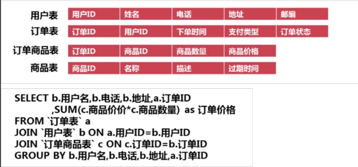
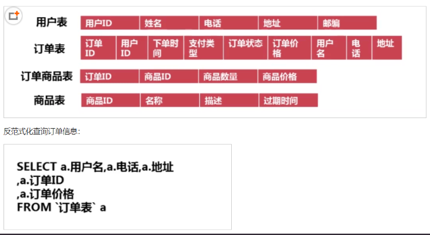
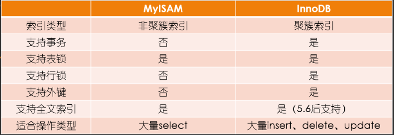

## schema与数据类型优化

### 数据类型的优化

* 更小的通常更好

> 应该尽量使用可以正确存储数据的最小数据类型，更小的数据类型通常更快，因为它们占用更少的磁盘、内存和CPU缓存，并且处理时需要的CPU周期更少，但是要确保没有低估需要存储的值的范围，如果无法确认哪个数据类型，就选择你认为不会超过范围的最小类型

> 案例：设计两张表，设计不同的数据类型，查看表的容量

* 简单就好

```text
简单数据类型的操作通常需要更少的CPU周期，例如，

1、整型比字符操作代价更低，因为字符集和校对规则是字符比较比整型比较更复杂，

2、使用mysql自建类型而不是字符串来存储日期和时间

3、用整型存储IP地址

案例：

创建两张相同的表，改变日期的数据类型，查看SQL语句执行的速度
```

* 尽量避免null

> 如果查询中包含可为NULL的列，对mysql来说很难优化，因为可为null的列使得索引、索引统计和值比较都更加复杂，坦白来说，通常情况下null的列改为not null带来的性能提升比较小，所有没有必要将所有的表的schema进行修改，但是应该尽量避免设计成可为null的列

### 数据类型的优化 - 实际细则

* 整数类型

> 可以使用的几种整数类型：TINYINT，SMALLINT，MEDIUMINT，INT，BIGINT分别使用8，16，24，32，64位存储空间。
  
> 尽量使用满足需求的最小数据类型

* 字符和字符串类型

```text
1、char长度固定，即每条数据占用等长字节空间；最大长度是255个字符，适合用在身份证号、手机号等定长字符串

2、varchar可变程度，可以设置最大长度；最大空间是65535个字节，适合用在长度可变的属性

3、text不设置长度，当不知道属性的最大长度时，适合用text

按照查询速度：char>varchar>text
```

varchar根据实际内容长度保存数据

```text
1、使用最小的符合需求的长度。
2、varchar(n) n小于等于255使用额外一个字节保存长度，n>255使用额外两个字节保存长度。
3、varchar(5)与varchar(255)保存同样的内容，硬盘存储空间相同，但内存空间占用不同，是指定的大小 。
4、varchar在mysql5.6之前变更长度，或者从255一下变更到255以上时时，都会导致锁表。
应用场景
    1、存储长度波动较大的数据，如：文章，有的会很短有的会很长
    2、字符串很少更新的场景，每次更新后都会重算并使用额外存储空间保存长度
    3、适合保存多字节字符，如：汉字，特殊字符等
```

char固定长度的字符串

```text
1、最大长度：255
2、会自动删除末尾的空格
3、检索效率、写效率 会比varchar高，以空间换时间
应用场景
    1、存储长度波动不大的数据，如：md5摘要
    2、存储短字符串、经常更新的字符串
```

* BLOB和TEXT类型

> MySQL 把每个 BLOB 和 TEXT 值当作一个独立的对象处理。
两者都是为了存储很大数据而设计的字符串类型，分别采用二进制和字符方式存储。


* datetime和timestamp

```text
1、不要使用字符串类型来存储日期时间数据

2、日期时间类型通常比字符串占用的存储空间小

3、日期时间类型在进行查找过滤时可以利用日期来进行比对

4、日期时间类型还有着丰富的处理函数，可以方便的对时间类型进行日期计算

5、使用int存储日期时间不如使用timestamp类型
```

```text
datetime
    占用8个字节
    与时区无关，数据库底层时区配置，对datetime无效
    可保存到毫秒
    可保存时间范围大
    不要使用字符串存储日期类型，占用空间大，损失日期类型函数的便捷性
timestamp
    占用4个字节
    时间范围：1970-01-01到2038-01-19
    精确到秒
    采用整形存储
    依赖数据库设置的时区
    自动更新timestamp列的值
date
    占用的字节数比使用字符串、datetime、int存储要少，使用date类型只需要3个字节
    使用date类型还可以利用日期时间函数进行日期之间的计算
    date类型用于保存1000-01-01到9999-12-31之间的日期
```

* 使用枚举代替字符串类型

> 有时可以使用枚举类代替常用的字符串类型，mysql存储枚举类型会非常紧凑，会根据列表值的数据压缩到一个或两个字节中，mysql在内部会将每个值在列表中的位置保存为整数，并且在表的.frm文件中保存“数字-字符串”映射关系的查找表
 
```sql
create table enum_test(e enum('fish','apple','dog') not null);

insert into enum_test(e) values('fish'),('dog'),('apple');

select e+0 from enum_test;
``` 

* 特殊类型数据

> 人们经常使用varchar(15)来存储ip地址，然而，它的本质是32位无符号整数不是字符串，可以使用INET_ATON()和INET_NTOA函数在这两种表示方法之间转换
 
```text
案例：

select inet_aton('1.1.1.1')

select inet_ntoa(16843009)
``` 
  

###  合理使用范式和反范式 

* 三范式
```text
第一范式：每一个字段原子性不可再分
第二范式：要求所有非主键字段完全依赖主键，不能产生部分依赖
第三范式：所有非主键字段和主键字段之间不能产生传递依赖

解释: 
1NF:原子性 字段不可再分,否则就不是关系数据库; 
2NF:唯一性 一个表只说明一个事物; 
3NF:每列都与主键有直接关系，不存在传递依赖; 
```

* 范式

```text
优点
    范式化的更新通常比反范式要快
    当数据较好的范式化后，很少或者没有重复的数据
    范式化的数据比较小，可以放在内存中，操作比较快
缺点
    通常需要进行关联
```

* 反范式

```text
优点
    所有的数据都在同一张表中，可以避免关联
    可以设计有效的索引；
缺点
    表格内的冗余较多，删除数据时候会造成表有些有用的信息丢失
```

* 在企业中很好能做到严格意义上的范式或者反范式，一般需要混合使用

> 在一个网站实例中，这个网站，允许用户发送消息，并且一些用户是付费用户。现在想查看付费用户最近的10条信息。  在user表和message表中都存储用户类型(account_type)而不用完全的反范式化。这避免了完全反范式化的插入和删除问题，因为即使没有消息的时候也绝不会丢失用户的信息。这样也不会把user_message表搞得太大，有利于高效地获取数据。

> 另一个从父表冗余一些数据到子表的理由是排序的需要。

> 缓存衍生值也是有用的。如果需要显示每个用户发了多少消息（类似论坛的），可以每次执行一个昂贵的自查询来计算并显示它；也可以在user表中建一个num_messages列，每当用户发新消息时更新这个值。

* 案例

范式设计



反范式设计



### 主键的选择

* 代理主键
    
    与业务无关的，无意义的数字序列
    
* 自然主键

    事物属性中的自然唯一标识
    
* 推荐使用代理主键

```text
它们不与业务耦合，因此更容易维护
一个大多数表，最好是全部表，通用的键策略能够减少需要编写的源码数量，减少系统的总体拥有成本
```

###   字符集的选择

> 字符集直接决定了数据在MySQL中的存储编码方式，由于同样的内容使用不同字符集表示所占用的空间大小会有较大的差异，所以通过使用合适的字符集，可以帮助我们尽可能减少数据量，进而减少IO操作次数。

1. 纯拉丁字符能表示的内容，没必要选择 latin1 之外的其他字符编码，因为这会节省大量的存储空间。

2. 如果我们可以确定不需要存放多种语言，就没必要非得使用UTF8或者其他UNICODE字符类型，这回造成大量的存储空间浪费。

3. MySQL的数据类型可以精确到字段，所以当我们需要大型数据库中存放多字节数据的时候，可以通过对不同表不同字段使用不同的数据类型来较大程度减小数据存储量，进而降低 IO 操作次数并提高缓存命中率。

### 存储引擎的选择

存储引擎的对比



### 适当的数据冗余

1. 被频繁引用且只能通过 Join 2张(或者更多)大表的方式才能得到的独立小字段。

> 物化视图（oracle）

2. 这样的场景由于每次Join仅仅只是为了取得某个小字段的值，Join到的记录又大，会造成大量不必要的 IO，完全可以通过空间换取时间的方式来优化。不过，冗余的同时需要确保数据的一致性不会遭到破坏，确保更新的同时冗余字段也被更新。

### 适当拆分

> 当我们的表中存在类似于 TEXT 或者是很大的 VARCHAR类型的大字段的时候，如果我们大部分访问这张表的时候都不需要这个字段，我们就该义无反顾的将其拆分到另外的独立表中，以减少常用数据所占用的存储空间。这样做的一个明显好处就是每个数据块中可以存储的数据条数可以大大增加，既减少物理 IO 次数，也能大大提高内存中的缓存命中率。


InternetArchitect\13mysql调优
