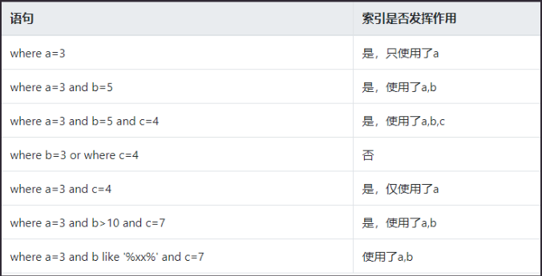

# 索引基本知识


## 索引的优点

```text
1、大大减少了服务器需要扫描的数据量
2、帮助服务器避免排序和临时表
3、将随机io变成顺序io
```

## 索引的用处

```text
1、快速查找匹配WHERE子句的行
2、从consideration中消除行,如果可以在多个索引之间进行选择，mysql通常会使用找到最少行的索引
3、如果表具有多列索引，则优化器可以使用索引的任何最左前缀来查找行
4、当有表连接的时候，从其他表检索行数据
5、查找特定索引列的min或max值
6、如果排序或分组时在可用索引的最左前缀上完成的，则对表进行排序和分组
7、在某些情况下，可以优化查询以检索值而无需查询数据行
```

## 索引的分类

* 主键索引

> 一般是在建表的时候指定了主键，就会创建主键索引， CREATE INDEX不能用来创建主键索引，使用 ALTER TABLE来代替
		
* 唯一索引

> 与普通索引类似，不同的就是：索引列的值必须唯一，但允许有空值。如果是组合索引，则列值的组合必须一
		
* 普通索引

> 这是最基本的索引，它没有任何限制
		
* 全文索引（MyISAM支持，InnoDB ddd5.6后支持）

> FULLTEXT索引用于全文搜索。只有InnoDB和 MyISAM存储引擎支持 FULLTEXT索引和仅适用于 CHAR， VARCHAR和 TEXT列

* 组合索引

> 一个索引包含多个列,(最左匹配),当包含多个列作为索引，需要注意的是正确的顺序依赖于该索引的查询，同时需要考虑如何更好的满足排序和分组的需要

案例，建立组合索引a,b,c



		
## 面试技术名词

* 回表

> 

* 覆盖索引

> 只需要在一棵索引树上就能获取SQL所需的所有列数据，无需回表，速度更快。
  
> explain的输出结果Extra字段为Using index时，能够触发索引覆盖。

哪些场景可以利用索引覆盖来优化SQL？

```text
场景1：全表count查询优化
    select count(name) from user;
    
场景2：列查询回表优化
    将单列索引(name)升级为联合索引(name, sex)，即可避免回表
    
场景3：分页查询
    将单列索引(name)升级为联合索引(name, sex)，也可以避免回表
```

* 最左匹配

* 索引下推

假设有这么个需求，查询表中“名字第一个字是张，性别男，年龄为10岁的所有记录”。那么，查询语句是这么写的：

```sql
select * from tuser where name like '张 %' and age=10 and ismale=1;
```

根据前面说的“最左前缀原则”，该语句在搜索索引树的时候，只能匹配到名字第一个字是‘张’的记录（即记录ID3），接下来是怎么处理的呢？当然就是从ID3开始，逐个回表，到主键索引上找出相应的记录，再比对age和ismale这两个字段的值是否符合。

但是！MySQL 5.6引入了索引下推优化，可以在索引遍历过程中，对索引中包含的字段先做判断，过滤掉不符合条件的记录，减少回表字数。

		
## 索引采用的数据结构

[索引数据结构选择](05_1_mysql索引数据结构选择.md)
		
## 索引匹配方式

* 全值匹配

全值匹配指的是和索引中的所有列进行匹配

```sql
explain select * from staffs where name = 'July' and age = '23' and pos = 'dev';
```
				
* 匹配最左前缀

只匹配前面的几列

```text
explain select * from staffs where name = 'July' and age = '23';
explain select * from staffs where name = 'July';
```
				
* 匹配列前缀
			
可以匹配某一列的值的开头部分

```text
explain select * from staffs where name like 'J%';
explain select * from staffs where name like '%y';
```
				
* 匹配范围值

可以查找某一个范围的数据

```text
explain select * from staffs where name > 'Mary';
```
		

* 精确匹配某一列并范围匹配另外一列
			
可以查询第一列的全部和第二列的部分

```text
explain select * from staffs where name = 'July' and age > 25;
```
				
* 只访问索引的查询
			
查询的时候只需要访问索引，不需要访问数据行，本质上就是覆盖索引

```text
explain select name,age,pos from staffs where name = 'July' and age = 25 and pos = 'dev';
```
