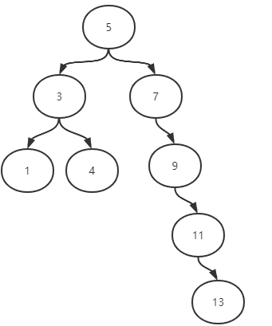
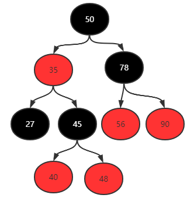
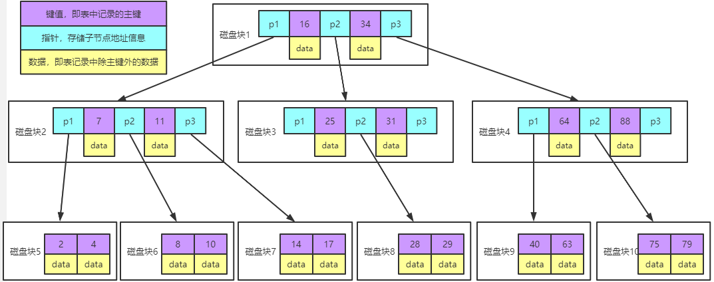
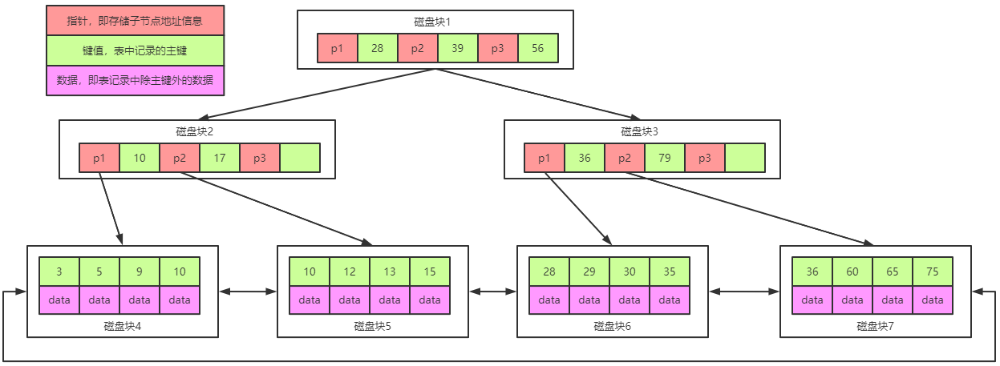
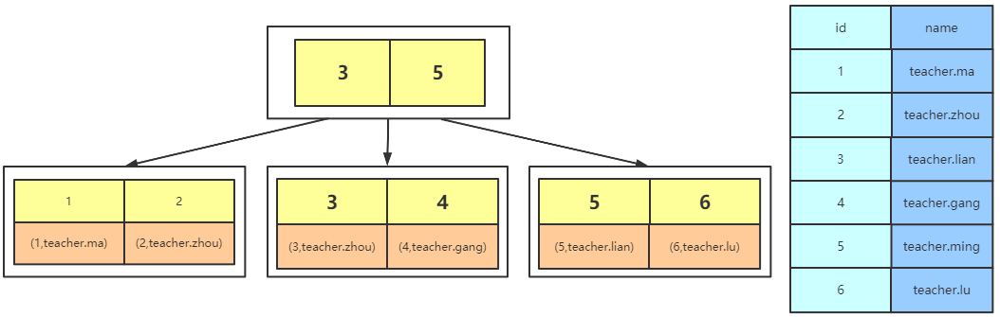
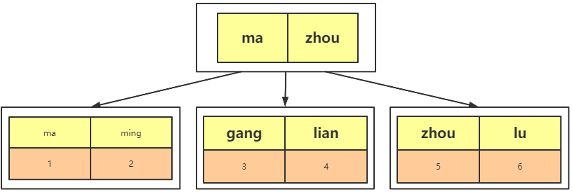
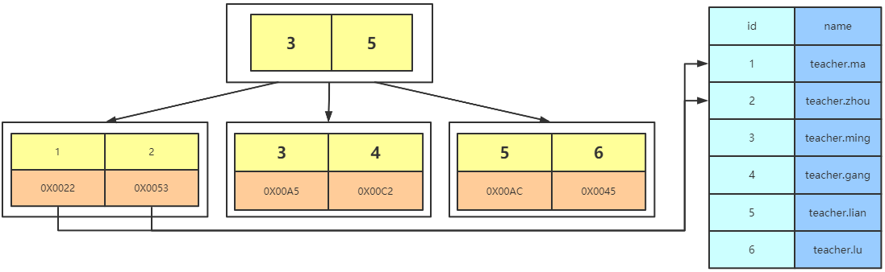

# MySQL索引数据结构选择

## hash表

缺点：

1、利用hash存储的话需要将所有的数据文件添加到内存，比较耗费内存空间

2、如果所有的查询都是等值查询，那么hash确实很快，但是在企业或者实际工作环境中范围查找的数据更多，而不是等值查询，因此hash就不太适合了


## 二叉树 & 红黑树






缺点：

无论是二叉树还是红黑树，都会因为树的深度过深而造成io次数变多，影响数据读取的效率


## B树

B树特点：
```text
1、所有键值分布在整颗树中
2、搜索有可能在非叶子结点结束，在关键字全集内做一次查找,性能逼近二分查找
3、每个节点最多拥有m个子树
4、根节点至少有2个子树
5、分支节点至少拥有m/2颗子树（除根节点和叶子节点外都是分支节点）
6、所有叶子节点都在同一层、每个节点最多可以有m-1个key，并且以升序排列
```



实例图说明：

> 每个节点占用一个磁盘块，一个节点上有两个升序排序的关键字和三个指向子树根节点的指针，指针存储的是子节点所在磁盘块的地址。两个关键词划分成的三个范围域对应三个指针指向的子树的数据的范围域。以根节点为例，关键字为 16 和 34，P1 指针指向的子树的数据范围为小于 16，P2 指针指向的子树的数据范围为 16~34，P3 指针指向的子树的数据范围为大于 34。 

查找关键字过程：
```text
1、根据根节点找到磁盘块 1，读入内存。【磁盘 I/O 操作第 1 次】
2、比较关键字 28 在区间（16,34），找到磁盘块 1 的指针 P2。
3、根据 P2 指针找到磁盘块 3，读入内存。【磁盘 I/O 操作第 2 次】
4、比较关键字 28 在区间（25,31），找到磁盘块 3 的指针 P2。
5、根据 P2 指针找到磁盘块 8，读入内存。【磁盘 I/O 操作第 3 次】
6、在磁盘块 8 中的关键字列表中找到关键字 28。 
```

缺点：
```text
1、每个节点都有key，同时也包含data，而每个页存储空间是有限的，如果data比较大的话会导致每个节点存储的key数量变小
2、当存储的数据量很大的时候会导致深度较大，增大查询时磁盘io次数，进而影响查询性能
```

## B+树

B+Tree是在BTree的基础之上做的一种优化，变化如下：

1. B+Tree每个节点可以包含更多的节点，这个做的原因有两个，第一个原因是为了降低树的高度，第二个原因是将数据范围变为多个区间，区间越多，数据检索越快

2. 非叶子节点存储key，叶子节点存储key和数据

3. 叶子节点两两指针相互连接（符合磁盘的预读特性），顺序查询性能更高

参考阅读：[B+树添加删除数据](../data_structure/B+树添加删除数据.md)



> 注意：在B+Tree上有两个头指针，一个指向根节点，另一个指向关键字最小的叶子节点，而且所有叶子节点（即数据节点）之间是一种链式环结构。因此可以对 B+Tree 进行两种查找运算：一种是对于主键的范围查找和分页查找，另一种是从根节点开始，进行随机查找。


## InnoDB B+Tree


注意：

1. InnoDB是通过B+Tree结构对主键创建索引，然后叶子节点中存储记录，如果没有主键，那么会选择唯一键，如果没有唯一键，那么会生成一个6位的row_id来作为主键

2. 如果创建索引的键是其他字段，那么在叶子节点中存储的是该记录的主键，然后再通过主键索引找到对应的记录,叫做回表

3. 同时由于InnoDB数据文件本身是一棵B+Tree，非单调的主键会造成在插入新记录时数据文件为了维持B+Tree的特性而频繁的分裂调整，造成效率低下，而使用自增字段作为主键则是一个很好的选择

主键索引查询




InnoDB对辅助索引采取的方式是在叶子页中保存主键值，通过这个主键值来回表查询到一条完整记录，所以按辅助索引检索实际上进行了二次查询，效率肯定是没有按照主键检索高的。下图是辅助索引的实现方式



## MyISAM B+Tree

MyISAM索引文件和数据文件是分离的，索引文件的data域保存记录所在页的地址（物理存储位置），通过这些地址来读取页，进而读取被索引的行数据




## 总结

1. InnoDB的数据文件本身就是主索引文件，而MyISAM的主索引和数据是分开的。

2. InnoDB的辅助索引data域存储相应记录主键的值而不是地址。而MyISAM的辅助索引和主索引没有多大区别。

3. innoDB是聚簇索引，数据存储在对应索引之下。
