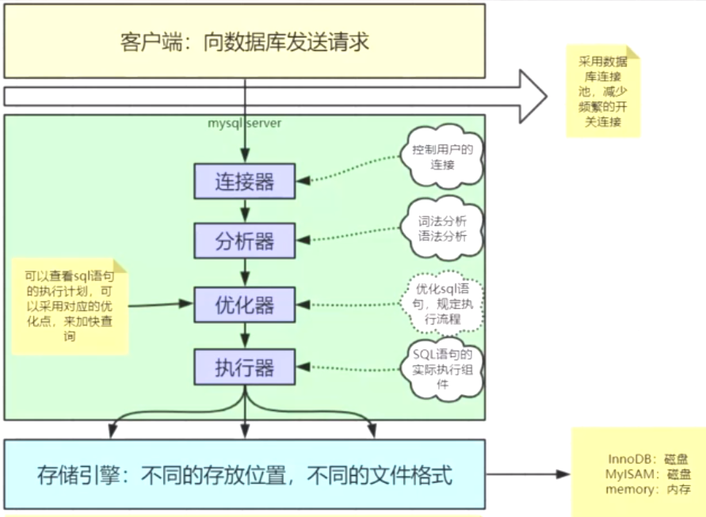
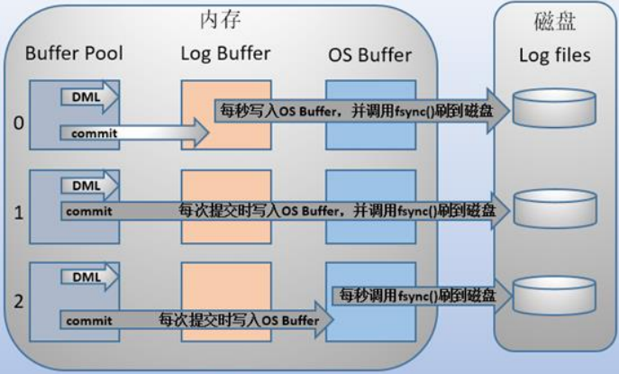
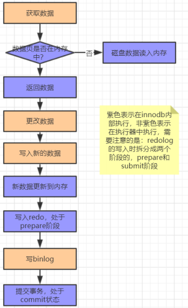

## mysql基本架构图

client

server server端的连接器-》分析器-》优化器-》执行器

查询缓存已经弃用

存储引擎



## 连接器

负责跟客户端建立连接，获取权限、维持和管理连接
```text
用户名密码验证
查询权限信息，分配对应权限
使用 `show processlist`查看现有连接
如果长时间没有动静，就会自动断开，通过wait_timeout控制，默认八小时
```

连接可分两类:

```text
长连接：推荐使用，但要周期性的断开长连接

短连接:
```

## 查询缓存

当执行查询语句的时候，先去查询缓存查看结果，之前执行的sql语句及其结果可能以K-V形式存储在缓存中，如果能找到则直接返回，如果找不到，就继续执行后续的阶段

默认不开启，需要更改配置开启，且查询缓存在某个版本已经没有了

不推荐使用查询缓存

```text
1. 查询缓存的失效比较频繁，只要表更新，缓存就会清空
2. 缓存对应新更新的数据命中率比较低
```

## 分析器

* 词法分析：

Mysql需要把输入的字符串进行识别每个部分代表什么意思

```text
–把字符串T 识别成表名T
–把字符串ID 识别成列ID  
```

* 语法分析：

根据语法规则判断这个sql语句是否满足mysql的语法，如果不符合就会报错“You have an error in your SQL synta”

## 优化器

具体执行SQL之前，要先经过优化器处理

```text
–当表中有多个索引的时候，决定用哪个索引
–当sql语句需要做多表关联的时候，决定表的连接顺序
–等等
```

不用的执行范式对SQL语句执行效率影响很大

```text
RBO:基于规则的优化
CBO:基于成本的优化
```


## 日志

binlog server端

redolog undolog 存储引擎

WAL write ahead log：预写日志

### redo log(前滚日志):

* 实现了事务的持久性(D)

当发生数据修改的时候，innodb引擎会先将记录写到redo log中，并更新内存，此时更新就算是完成了，同时innodb引擎会在合适的时机将记录操作到磁盘中

Redolog是固定大小的，是循环写的过程

有了redolog之后，innodb就可以保证即使数据库发生异常重启，之前的记录也不会丢失，叫做crash-safe


* 既然要避免io，为什么写redo log的时候不会造成io的问题:





### undo log(回滚日志)

(InnoDB)为了实现事务原子性


Undo Log是为了实现事务的原子性，在MySQL数据库InnoDB存储引擎中，还用Undo Log来实现多版本并发控制(简称：MVCC)

在操作任何数据之前，首先将数据备份到一个地方（这个存储数据备份的地方称为Undo Log）。然后进行数据的修改。如果出现了错误或者用户执行了ROLLBACK语句，系统可以利用Undo Log中的备份将数据恢复到事务开始之前的状态

undo log 是逻辑日志，可以理解为：
```text
delete一条记录时，undolog记录一条对应的insert日志
insert - delete
update - 相反的update
```

### bin log(归档日志)

Binlog是server层的日志，主要做mysql功能层面的事情。通过配置开启

与redo log区别

```text
1、redo是innodb独有的，binlog是所有引擎都可以使用的
2、redo是物理日志，记录的是在某个数据页上做了什么修改，binlog是逻辑日志，记录的是这个语句的原始逻辑
3、redo是循环写的，空间会用完，binlog是可以追加写的，不会覆盖之前的日志信息
```

* Binlog中会记录所有的逻辑，并且采用追加写的方式

* 一般在企业中数据库会有备份系统，可以定期执行备份，备份的周期可以自己设置

* 恢复数据的过程：

```text
1、找到最近一次的全量备份数据
2、从备份的时间点开始，将备份的binlog取出来，重放到要恢复的那个时刻
```


锁机制：实现事务隔离性


## 数据更新流程



1、执行器先从引擎中找到数据，如果在内存中直接返回，如果不在内存中，查询后返回

2、执行器拿到数据之后会先修改数据，然后调用引擎接口重新吸入数据

3、引擎将数据更新到内存，同时写数据到redo中，此时处于prepare阶段，并通知执行器执行完成，随时可以操作

4、执行器生成这个操作的binlog

5、执行器调用引擎的事务提交接口，引擎把刚刚写完的redo改成commit状态，更新完成


## Redo log的两阶段提交

先写redo log后写binlog:假设在redo log写完，binlog还没有写完的时候，MySQL进程异常重启。由于我们前面说过的，redo log写完之后，系统即使崩溃，仍然能够把数据恢复回来，所以恢复后这一行c的值是1。但是由于binlog没写完就crash了，这时候binlog里面就没有记录这个语句。因此，之后备份日志的时候，存起来的binlog里面就没有这条语句。然后你会发现，如果需要用这个binlog来恢复临时库的话，由于这个语句的binlog丢失，这个临时库就会少了这一次更新，恢复出来的这一行c的值就是0，与原库的值不同。
  
先写binlog后写redo log:如果在binlog写完之后crash，由于redo log还没写，崩溃恢复以后这个事务无效，所以这一行c的值是0。但是binlog里面已经记录了“把c从0改成1”这个日志。所以，在之后用binlog来恢复的时候就多了一个事务出来，恢复出来的这一行c的值就是1，与原库的值不同。
