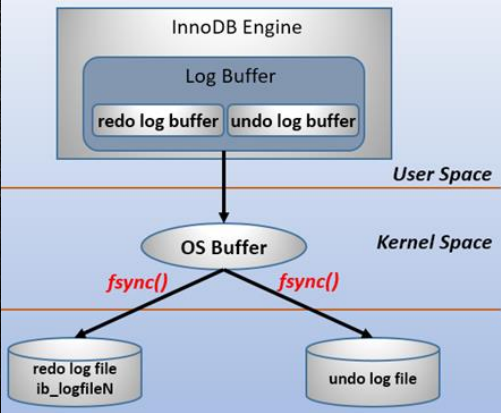

## mysql基本架构图

client

server server端的连接器-》分析器-》优化器-》执行器

查询缓存已经弃用

存储引擎


## 连接器

负责跟客户端建立连接，获取权限、维持和管理连接
```text
用户名密码验证
查询权限信息，分配对应权限
使用 `show processlist`查看现有连接
如果长时间没有动静，就会自动断开，通过wait_timeout控制，默认八小时
```

连接可分两类:

```text
长连接：推荐使用，但要周期性的断开长连接

短连接:
```

## 查询缓存

当执行查询语句的时候，先去查询缓存查看结果，之前执行的sql语句及其结果可能以K-V形式存储在缓存中，如果能找到则直接返回，如果找不到，就继续执行后续的阶段

默认不开启，需要更改配置开启，且查询缓存在某个版本已经没有了

不推荐使用查询缓存

```text
1. 查询缓存的失效比较频繁，只要表更新，缓存就会清空
2. 缓存对应新更新的数据命中率比较低
```

## 分析器

词法分析

语法分析

## 优化器

具体执行SQL之前，要先经过优化器处理

不用的执行范式对SQL语句执行效率影响很大

```text
RBO:基于规则的优化
CBO:基于成本的优化
```


## 日志

binlog server端

redolog undolog 存储引擎

WAL write ahead log：预写日志

redo log(前滚日志):

* 持久性




* undo log(回滚日志)

(InnoDB)为了实现原子性

多版本并开发控制MVCC

undo log 是逻辑日志，可以理解为：
```text
delete一条记录时，undolog记录一条对应的insert日志
insert - delete
update - 相反的update
```

* bin log(归档日志)

通过配置开启

与redo log区别

```text
redo是innodb独有的，binlog所有引擎都可用
redo是物理日志，记录的是在某个数据页上做了扫描修改，binlog是逻辑日志，记录的是这个语句的原始逻辑
redo循环写，binlog追加写，不会覆盖之前
```


锁机制：隔离性


## 数据更新流程

