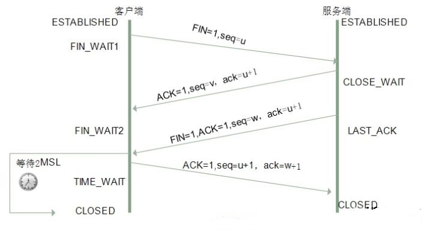

#TCP

##问题
* 请画出三次握手和四次挥手的示意图
* 为什么连接的时候是三次握手？
* 什么是半连接队列？
* ISN(Initial Sequence Number)是固定的吗？
* 三次握手过程中可以携带数据吗？
* 如果第三次握手丢失了，客户端服务端会如何处理？
* SYN攻击是什么？
* 挥手为什么需要四次？
* 四次挥手释放连接时，等待2MSL的意义?

##TCP 协议的报文头


跟我们今天要讨论的连接协议相关的就是中间那六个状态位： URG、ACK、PSH、RST、SYN、FIN ，都置为 1 表示有效，
在这六个当中，我们主要关注重点关注 ACK、SYN、FIN 这三个。下面解释一下这三个状态位：

* ACK：用于对收到的数据进行确认，所确认的数据由确认序列号表示
* SYN：用作建立连接时的同步信号
* FIN：表示后面没有数据需要发送，通常意昧着所建立的连接需要关闭了

##三次握手

###过程


三次握手总体来说就是呼叫、应答、回应，我们来详细的介绍每一步：

* 第一步： A 机器向 B机器发出一个数据包并将 SYN 设置为 1 ，表示希望建立连接。这个包中的序列号假设是 X。
* 第二步： B 机器收到 A机器发过来的数据包后，通过 SYN 得知这是一个建立连接的请求，于是发送一个响应包并将 SYN 、ACK 标记都置为 1。假设这个包中的序列号是 y ，而确认序列号必须是 x+1 ，表示收到了 发过来的 SYN，TCP 中， SYN 被当作数据部分的一个字节。
* 第三步： A 收到 的响应包后需进行确认，确认包中将 ACK ，并将确认序列号设置为 y+1，表示收到了来自B 的 SYN

###目的
三次握手的目的是为了同步双方的初始序列号，这是后续全双工通信的根基


* 第一次握手：客户端发送网络包，服务端收到了。
>这样服务端就能得出结论：客户端的发送能力、服务端的接收能力是正常的。
* 第二次握手：服务端发包，客户端收到了。
>这样客户端就能得出结论：服务端的接收、发送能力，客户端的接收、发送能力是正常的。不过此时服务器并不能确认客户端的接收能力是否正常。
* 第三次握手：客户端发包，服务端收到了。
>这样服务端就能得出结论：客户端的接收、发送能力正常，服务器自己的发送、接收能力也正常。

因此，需要三次握手才能确认双方的接收与发送能力是否正常。


##半连接队列
服务器第一次收到客户端的 SYN 之后，就会处于 SYN_RCVD 状态，此时双方还没有完全建立其连接，服务器会把此种状态下请求连接放在一个队列里，我们把这种队列称之为半连接队列。

>当然还有一个全连接队列，就是已经完成三次握手，建立起连接的就会放在全连接队列中。如果队列满了就有可能会出现丢包现象。

##ISN(Initial Sequence Number)是固定的吗

当一端为建立连接而发送它的SYN时，它为连接选择一个初始序号。ISN随时间而变化，因此每个连接都将具有不同的ISN。ISN可以看作是一个32比特的计数器，每4ms加1 。这样选择序号的目的在于防止在网络中被延迟的分组在以后又被传送，而导致某个连接的一方对它做错误的解释。

三次握手的其中一个重要功能是客户端和服务端交换 ISN(Initial Sequence Number)，以便让对方知道接下来接收数据的时候如何按序列号组装数据。如果 ISN 是固定的，攻击者很容易猜出后续的确认号，因此 ISN 是动态生成的。

##三次握手过程中可以携带数据吗

其实第三次握手的时候，是可以携带数据的。但是，第一次、第二次握手不可以携带数据

为什么这样呢?大家可以想一个问题，假如第一次握手可以携带数据的话，如果有人要恶意攻击服务器，那他每次都在第一次握手中的 SYN 报文中放入大量的数据。因为攻击者根本就不理服务器的接收、发送能力是否正常，然后疯狂着重复发 SYN 报文的话，这会让服务器花费很多时间、内存空间来接收这些报文。

也就是说，第一次握手不可以放数据，其中一个简单的原因就是会让服务器更加容易受到攻击了。而对于第三次的话，此时客户端已经处于 ESTABLISHED 状态。对于客户端来说，他已经建立起连接了，并且也已经知道服务器的接收、发送能力是正常的了，所以能携带数据也没啥毛病。

## SYN攻击是什么
服务器端的资源分配是在二次握手时分配的，而客户端的资源是在完成三次握手时分配的，所以服务器容易受到SYN洪泛攻击。SYN攻击就是Client在短时间内伪造大量不存在的IP地址，并向Server不断地发送SYN包，Server则回复确认包，并等待Client确认，由于源地址不存在，因此Server需要不断重发直至超时，这些伪造的SYN包将长时间占用未连接队列，导致正常的SYN请求因为队列满而被丢弃，从而引起网络拥塞甚至系统瘫痪。SYN 攻击是一种典型的 DoS/DDoS 攻击。

检测 SYN 攻击非常的方便，当你在服务器上看到大量的半连接状态时，特别是源IP地址是随机的，基本上可以断定这是一次SYN攻击。在 Linux/Unix 上可以使用系统自带的 netstats 命令来检测 SYN 攻击。

```netstat -n -p TCP | grep SYN_RECV```

常见的防御 SYN 攻击的方法有如下几种：
* 缩短超时（SYN Timeout）时间
* 增加最大半连接数
* 过滤网关防护
* SYN cookies技术


##四次挥手


### 挥手为什么需要四次？
   
>因为当服务端收到客户端的SYN连接请求报文后，可以直接发送SYN+ACK报文。其中ACK报文是用来应答的，SYN报文是用来同步的。但是关闭连接时，当服务端收到FIN报文时，很可能并不会立即关闭SOCKET，所以只能先回复一个ACK报文，告诉客户端，“你发的FIN报文我收到了”。只有等到我服务端所有的报文都发送完了，我才能发送FIN报文，因此不能一起发送。故需要四次挥手。

###2MSL等待状态

TIME_WAIT状态也成为2MSL等待状态。每个具体TCP实现必须选择一个报文段最大生存时间MSL（Maximum Segment Lifetime），它是任何报文段被丢弃前在网络内的最长时间。这个时间是有限的，因为TCP报文段以IP数据报在网络内传输，而IP数据报则有限制其生存时间的TTL字段。

对一个具体实现所给定的MSL值，处理的原则是：当TCP执行一个主动关闭，并发回最后一个ACK，该连接必须在TIME_WAIT状态停留的时间为2倍的MSL。这样可让TCP再次发送最后的ACK以防这个ACK丢失（另一端超时并重发最后的FIN）。

这种2MSL等待的另一个结果是这个TCP连接在2MSL等待期间，定义这个连接的插口（客户的IP地址和端口号，服务器的IP地址和端口号）不能再被使用。这个连接只能在2MSL结束后才能再被使用。

###四次挥手释放连接时，等待2MSL的意义

2MSL是Maximum Segment Lifetime的英文缩写，可译为“最长报文段寿命”，它是任何报文在网络上存在的最长时间，超过这个时间报文将被丢弃。

>为了保证客户端发送的最后一个ACK报文段能够到达服务器。因为这个ACK有可能丢失，从而导致处在LAST-ACK状态的服务器收不到对FIN-ACK的确认报文。服务器会超时重传这个FIN-ACK，接着客户端再重传一次确认，重新启动时间等待计时器。最后客户端和服务器都能正常的关闭。假设客户端不等待2MSL，而是在发送完ACK之后直接释放关闭，一但这个ACK丢失的话，服务器就无法正常的进入关闭连接状态。

两个理由：
* 保证客户端发送的最后一个ACK报文段能够到达服务端。

>这个ACK报文段有可能丢失，使得处于LAST-ACK状态的B收不到对已发送的FIN+ACK报文段的确认，服务端超时重传FIN+ACK报文段，而客户端能在2MSL时间内收到这个重传的FIN+ACK报文段，接着客户端重传一次确认，重新启动2MSL计时器，最后客户端和服务端都进入到CLOSED状态，若客户端在TIME-WAIT状态不等待一段时间，而是发送完ACK报文段后立即释放连接，则无法收到服务端重传的FIN+ACK报文段，所以不会再发送一次确认报文段，则服务端无法正常进入到CLOSED状态。

* 防止“已失效的连接请求报文段”出现在本连接中。

>客户端在发送完最后一个ACK报文段后，再经过2MSL，就可以使本连接持续的时间内所产生的所有报文段都从网络中消失，使下一个新的连接中不会出现这种旧的连接请求报文段。

###为什么TIME_WAIT状态需要经过2MSL才能返回到CLOSE状态

理论上，四个报文都发送完毕，就可以直接进入CLOSE状态了，但是可能网络是不可靠的，有可能最后一个ACK丢失。所以TIME_WAIT状态就是用来重发可能丢失的ACK报文。
