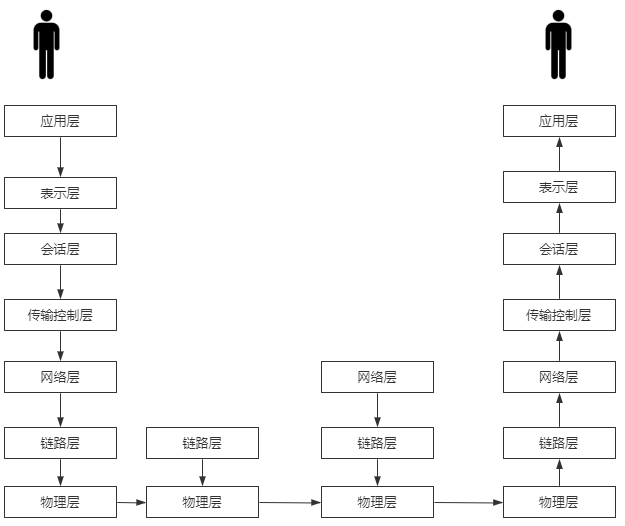
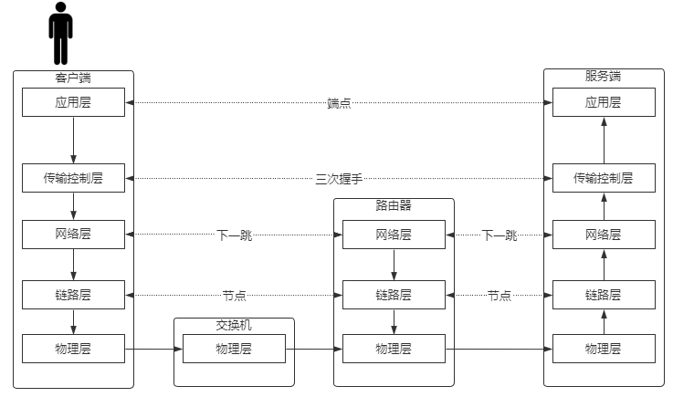

## 建立连接

### OSI参考模型



如何寻址：
```text
源端口号->目标端口号 - 和目标服务器哪个端口通信
源IP地址->目标IP地址 - 找到目标服务器
源MAC地址->目标MAC地址 - 找到下一跳
```

```text
结论：
TCP/IP协议：
基于下一跳的机制：
IP是端点间
mac地址是节点间的
```

```text
三次握手>数据传输>四次分手
成为一个最小粒度
不可被分割
```

### TCP/IP 4/5层协议



### 建立连接-传输数据


### 网络层下一跳机制

数据包是下一跳的MAC地址和目标的ip，每跳一次，源/目标MAC地址都会变

```text
route -n
路由判定
按位与
```


### 找到下一跳节点的MAC地址

ARP（Address Resolution Protocol）是一个重要的TCP/IP协议，并且用于确定对应IP地址的网卡物理地址


### 示例


## 四层负载均衡

```text
客户端去连服务器
客户端不和负载均衡握手

```


### NAT 模型

路由器修改的是源地址(S-NAT)


修改目标地址 D-NAT

基于D-NAT的负载均衡（3-4层，网络层）

缺陷
```text
非对称(客户端请求内容少，服务端返回内容多)
带宽成为瓶颈
消耗算力(RIP->DIP转换)
要求RS的GW指向负载均衡服务器
```


### DR 模型

基于DR(direct route，直接路由模型)的负载均衡（2层链路层）

```text
DR
基于2层
mac地址欺骗
速度快
成本低
负载和RS要再同一局域网
```


隐藏VIP方法：对外隐藏，对内可见 ：
```
kernel parameter:
目标mac地址为全F，交换机触发广播
  /proc/sys/net/ipv4/conf/*IF*/
  
修改两个参数：  
arp_ignore: 定义接收到ARP请求时的响应级别；
  0：只要本地配置的有相应地址，就给予响应；
  1：仅在请求的目标(MAC)地址配置请求
        到达的接口上的时候，才给予响应；

arp_announce：定义将自己地址向外通告时的通告级别；
  0：将本地任何接口上的任何地址向外通告；
  1：试图仅向目标网络通告与其网络匹配的地址；
  2：仅向与本地接口上地址匹配的网络进行通告；

```

### TUN 模型

```text
TUN隧道技术
VPN  &  翻墙
```


### 添加一块虚拟网卡

```text
ifconfig eth0:2 192.168.150.100/24  #等同于下面  eth0:2 -> 子网

ifconfig eth0:2 192.168.150.100 netmask 255.255.255.0

```
## LVS三种转发类型总结


* LVS-NAT模型，称为网络地址转换，实现起来比较简单

```text
所有的RealServer集群节点和前端调度器Director都要在同一个子网中
这种模型可以实现端口映射
RealServer的操作系统可以是任意操作系统
前端的Director既要处理客户端发起的请求，又要处理后台RealServer的响应信息，将RealServer响应的信息再转发给客户端
前端Director很容易成为整个集群系统性能的瓶颈。
通常情况下RealServer的IP地址(以下简成RIP)为私有地址，便于RealServer集群节点之间进行通信
通常情况下前端的Director有两个IP地址，一个为VIP，是虚拟的IP地址，客户端向此IP地址发起请求。一个是DIP，是真正的Director的IP地址，RIP的网关要指向Director的DIP。
```
* LVS-DR模型，称为直接路由模型，应用比较广泛，此种模型通过MAC地址转发工作

```text
所有的RealServer集群节点和前端调度器Director都要在同一个物理网络中
此种模型不支持端口映射
RealServer可以使用大多数的操作系统
前端的Director只处理客户端的请求，然后将请求转发给RealServer，由后台的RealServer直接响应客户端，不再经过Director
此种模型的性能要优于LVS-NAT
RIP可以使用公网的IP
RIP的网关不能指向DIP
```

* LVS-TUN模型，称为隧道模型

```text
RealServer服务器与前端的Director可以在不同的网络中
此种模型也不支持端口映射
RealServer只能使用哪些支持IP隧道的操作系统
前端的Director只处理客户端的请求，然后将请求转发给RealServer，由后台的RealServer直接响应客户端，不再经过Director
RIP一定不能是私有IP
```
