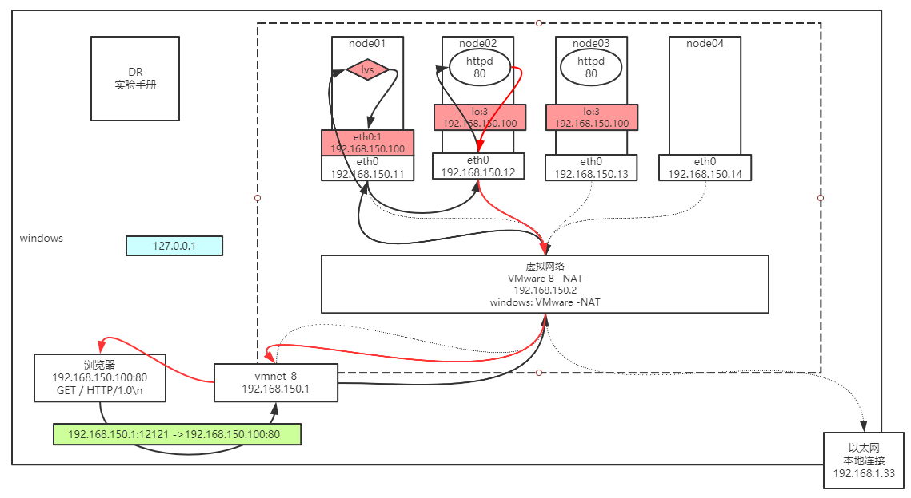

## LVS的DR模型试验搭建




### 配置 node01:

```text
ifconfig  eth0:8 192.168.150.100/24
```

### 配置 node02~node03:

1. 修改内核：
    ```text
    echo 1  >  /proc/sys/net/ipv4/conf/eth0/arp_ignore 
    echo 1  >  /proc/sys/net/ipv4/conf/all/arp_ignore 
    echo 2  >  /proc/sys/net/ipv4/conf/eth0/arp_announce 
    echo 2  >  /proc/sys/net/ipv4/conf/all/arp_announce 
    ```
2. 设置隐藏的vip：

    ```text
	    ifconfig  lo:3  192.168.150.100  netmask 255.255.255.255
    ```
		
### RS中的服务：

  * node02~node03:
    ```text
    yum install httpd -y
    service httpd start
    vi   /var/www/html/index.html
        from 192.168.150.1x
    ```

### LVS服务配置

  * node01:
  
  ```text
	 yum install ipvsadm 
	 ipvsadm -A  -t  192.168.150.100:80  -s rr
	 ipvsadm -a  -t 192.168.150.100:80  -r  192.168.150.12 -g -w 1
	 ipvsadm -a  -t 192.168.150.100:80  -r  192.168.150.13 -g -w 1
	 ipvsadm -ln
  ```

### 验证：

* 浏览器访问  192.168.150.100   看到负载  疯狂F5
	
* node01查看连接

```text
netstat -natp   结论看不到socket连接
```
		
* node02~node03 查看连接

```text
netstat -natp   结论看到很多的socket连接
```
		
* node01查看偷窥记录本
	
```text
ipvsadm -lnc    查看偷窥记录本
TCP 00:57  FIN_WAIT    192.168.150.1:51587 192.168.150.100:80 192.168.150.12:80
FIN_WAIT： 连接过，偷窥了所有的包
SYN_RECV： 基本上lvs都记录了，证明lvs没事，一定是后边网络层出问题
```
