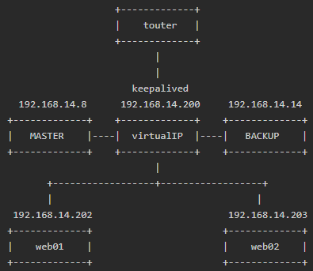

### 安装

* 在线安装

```text
yum -y install keepalived ipvsadm
```

* 源码安装

```text
wget http://www.keepalived.org/software/keepalived-1.2.15.tar.gz
tar -xf keepalived-1.2.15.tar.gz && cd keepalived-1.2.15
./configure && make && make install

wget http://www.linuxvirtualserver.org/software/kernel-2.6/ipvsadm-1.26.tar.gz
tar -xf ipvsadm-1.26.tar.gz && cd ipvsadm-1.26/
make && make install
```

* 关闭SELinux（改完后需重启服务器）

```text
sed -i 's#^SELINUX=.*#SELINUX=disabled#' /etc/sysconfig/selinux  
```

* 创建ipvsadm配置文件，启动并加入开机启动

```text
/etc/init.d/ipvsadm save
/etc/init.d/ipvsadm start
chkconfig ipvsadm on
```

### 实例：搭建lvs+keepalived

#### 1.本文搭建、测试lvs+keepalived。测试环境使用4台真实服务器，如下介绍：

```text
虚拟ip ： 192.168.14.200，默认指向Master(192.168.14.8)
真实服务器1 ： Master，192.168.14.8， 该机器上同时运行Apache Httpd服务(端口80)用作sorry_server且通常不提供服务；
真实服务器2 ： Backup，192.168.14.14， 该机器上同时运行Apache Httpd服务(端口80)用作sorry_server且通常不提供服务；
真实服务器3 ： web01 ，192.168.14.202， 该机器上运行Apache Httpd服务(端口80)用作后端server且通常提供服务；
真实服务器4 ： web02 ，192.168.14.203， 该机器上运行Apache Httpd服务(端口80)用作后端server且通常提供服务；
```

#### 2.系统部署结构图如下所示：



#### 3.每台机器上安装的服务有：

```text
Master、Backup：keepalived
web01、web02：设置lvs选项
```

#### 4.创建keepalived配置文件

keepalived只有一个配置文件keepalived.conf，里面主要包括以下几个配置区域，分别是global_defs、static_ipaddress、static_routes、vrrp_script、vrrp_instance和virtual_server。其中vrrp_instance区域用来定义对外提供服务的VIP区域及其相关属性， virtual_server、real_server区域是用来配合lvs使用的。

##### 4.1 在Master(192.168.14.8)上:

cat /etc/keepalived/keepalived.conf

```text
global_defs {
   notification_email {
   #  acassen@firewall.loc   # 指定keepalived在发生切换时需要发送email到的对象，一行一个
   }
   #notification_email_from Alexandre.Cassen@firewall.loc  # 指定发件人
   #smtp_server 192.168.200.1       # smtp 服务器地址
   #smtp_connect_timeout 30         # smtp 服务器连接超时时间
   router_id LVS_DEVEL              # 运行keepalived机器的一个标识
}

vrrp_instance VI_1 {
    state MASTER                    #
    interface eth0
    virtual_router_id 51
    priority 100
    advert_int 1
    authentication {
        auth_type PASS
        auth_pass 1111
    }
    virtual_ipaddress {
        192.168.14.200
    }
}
virtual_server 192.168.14.200 80 {
    delay_loop 6                     # 设置健康检查时间，单位是秒
    lb_algo wlc                      # 设置负载调度的算法为wlc(最小加权算法)
    lb_kind DR                       # 设置LVS负载均衡模式为dr机制(NAT、TUN、DR)
    persistence_timeout 50           # 会话保持时间
    protocol TCP                     # 指定转发协议类型(TCP、UDP)

    sorry_server   127.0.0.1 80      # 当所有的real_server都不可用时将请求转发到该server上

    real_server 192.168.14.202 80 {  # 设置真实的后端server
        weight 3                     # 配置节点权值，数字越大权重越高
        TCP_CHECK {                  # 健康检查方式
            connect_timeout 10       # 连接超时
            nb_get_retry 3           # 重试次数
            delay_before_retry 3     # 重试间隔
            connect_port 80          # 检查时连接的端口
        }
    }

    real_server 192.168.14.203 80 {  # 设置真实的后端server
        weight 3                     # 配置节点权值，数字越大权重越高
        TCP_CHECK {                  # 健康检查方式
            connect_timeout 10       # 连接超时
            nb_get_retry 3           # 重试次数
            delay_before_retry 3     # 重试间隔
            connect_port 80          # 检查时连接的端口
        }
    }
}
```

其中常用的健康检查方式健康检查方式一共有HTTP_GET、SSL_GET、TCP_CHECK、SMTP_CHECK和MISC_CHECK等。

##### 4.2 在Backup(192.168.14.14)上

其keepalived.conf与Master上基本一致，注意修改state为BACKUP，priority值改小即可。

#### 5. 分别在Master、Backup上启动keepalived：

```text
service keepalived start
```

#### 6. 创建lvs脚本

cat /etc/init.d/lvs

```text
#!/bin/bash
#description:start realserver
vip=192.168.14.200   # 虚拟ip，注意和Master、Backup上的virtual_ipaddress保持一致
source /etc/rc.d/init.d/functions
case $1 in
start)
        echo "Start Realserver"
        /sbin/ifconfig lo:0 $vip broadcast $vip netmask 255.255.255.255 up
        echo "1" > /proc/sys/net/ipv4/conf/lo/arp_ignore
        echo "2" > /proc/sys/net/ipv4/conf/lo/arp_announce
        echo "1" > /proc/sys/net/ipv4/conf/all/arp_ignore
        echo "2" > /proc/sys/net/ipv4/conf/all/arp_announce
;;
stop)
        echo "Stop Realserver"
        /sbin/ifconfig lo:0 down
        echo "0" > /proc/sys/net/ipv4/conf/lo/arp_ignore
        echo "0" > /proc/sys/net/ipv4/conf/lo/arp_announce
        echo "0" > /proc/sys/net/ipv4/conf/all/arp_ignore
        echo "0" > /proc/sys/net/ipv4/conf/all/arp_announce
;;
*)
        echo "Usage: $0 (start | stop)"
exit 1
esac
```


#### 7. 在web01、web02上运行：

```text
service lvs start
```
#### 8. 查看ipvs规则

如果想查看生效规则，只需安装ipvsadm即可。

```text
ipvsadm -L -n

IP Virtual Server version 1.2.1 (size=4096)
Prot LocalAddress:Port Scheduler Flags
  -> RemoteAddress:Port           Forward Weight ActiveConn InActConn
TCP  192.168.14.200:80 wlc persistent 50
  -> 192.168.14.202:80            Route   3      0          0         
  -> 192.168.14.203:80            Route   3      0          0   
```


#### 9. 验证

* 负载均衡测试

```text
两台real-server上的web服务都启动，通过VIP访问，正常
停掉其中一台real-server上的web服务，所有请求被负载到另一台read-server上；
停掉两台real-server上的web服务，所有请求都被负载到Master主机上预定于的sorry_server上；
启动real-server上的web服务，新的请求不再转发到sorry_server，而是抓到real-server上；
```

* 高可用测试

```text
停掉Backup上的keepalived，没有任何影响
停掉Master上的keepalived(Backup的keepalived要运行)，此时VIP切换到Backup上，所有请求正常处理；
停掉Master和Backup上的keepalived，无法再通过VIP访问
```


