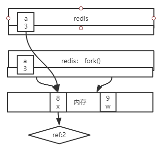
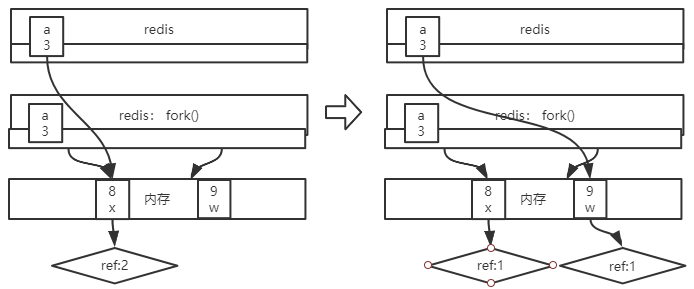
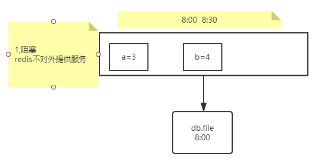
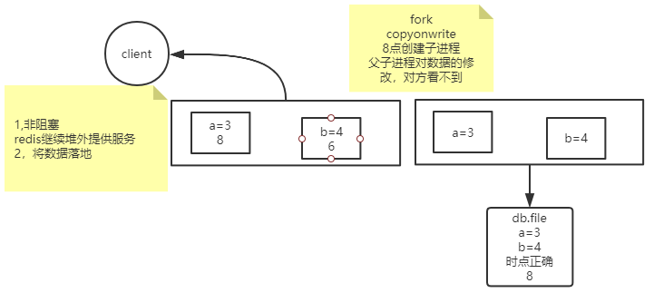

## 持久化RDB

### 1.前置知识：管道

1，衔接，前一个命令的输出作为后一个命令的输入

2，管道会触发创建【子进程】

```text
echo $$  |   more   //输出仍然是父进程pid
echo $BASHPID |  more //输出子进程pid   $$ 优先级高于 |  
```

### 2.前置知识：父子进程

使用linux的时候：父子进程

* 父进程的数据，子进程可不可以看得到？

```text
常规思想，进程是数据隔离的！

进阶思想，父进程其实可以让子进程看到数据！(export)

linux中 export的环境变量，子进程的修改不会破坏父进程，父进程的修改也不会破坏子进程
```

* 创建子进程的速度应该是什么程度？

如果父进程是redis，内存数据比如10G

  ```text
   速度
   内存空间够不够
  ```



### 3. fork & copy on write

* fork() 是系统调用，copy on write 是内核机制

```text
1，速度：快
2，空间：小
```


* copy on write：内核机制

```text
写时复制

创建子进程并不发生复制

创建进程变快了
根据经验，不可能父子进程把所有数据都改一遍
玩的是指针
```




 
### 4. 总结：redis将数据持久化

#### 1. 阻塞模型



#### 2. fork 模型




#### 3.实现方式

* 人为触发的命令：

```text
1. save  #仍然是阻塞的，redis不对外提供服务，比如关机维护时。
2. bgsave #fork 创建子进程
```

* 配置文件中编写bgsave规则，用的是save标识，触发的是bgsave

/etc/redis/6379.conf,找到 SNAPSHOTTING

```text
save <seconds> <changes> 
save 900 1
save 300 10
save 60 10000

dbfilename dump.rdb
dir /var/lib/redis/6379 
```


### 5. RDB的优缺点

缺点:

* 不支持拉链，只有一个dump.rdb

* 丢失数据相对多一些,时点与时点之间窗口数据容易丢失

> 8点得到一个rdb，9点刚要落一个rdb，挂机了

优点：

* 类似java中的序列化,恢复的速度相对快

> 直接把二进制数据序列化到磁盘，从磁盘反序列化到内存
