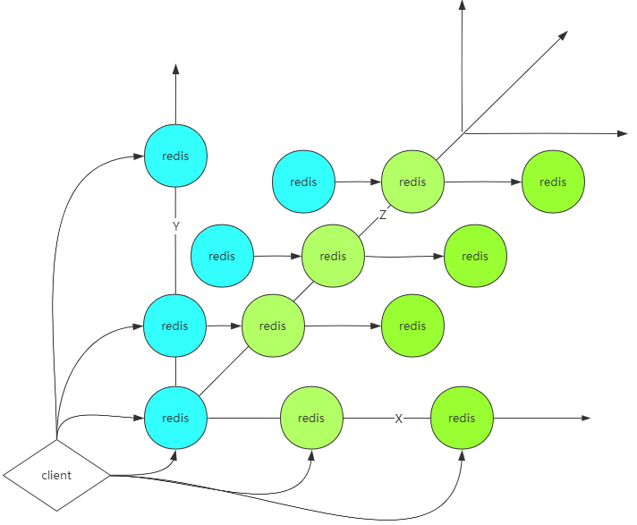

## Redis集群

### 单机、单节点、单实例的问题

```text
1，单点故障
2，容量有限
3，压力
```


### 通过AKF 一变多

AKF:通过加机器可以解决容量和可用性问题（如果一台不行就两台）

```text
X：全量，镜像： 解决单点故障
Y：业务，功能拆分： 
Z：优先级，逻辑再拆分： 
```




### AKF一致性处理

```text
数据一致性：
1.强一致性：
所有节点阻塞直到数据全部一致，同步方式阻塞方式，破坏可用性！

反问自己：为什么一变多->解决可用性

强一致性降级-最终一致性：
1，通过异步方式
2，容忍数据丢失一部分
```


## AKF: X

### 人工方式做主从复制

```text
6379 redis-server 6379.conf
6380 redis-server 6380.conf  --replicaof 127.0.0.1 6379
6381 redis-server 6381.conf  --replicaof 127.0.0.1 6379
```

### 主从复制配置

```text
replica-serve-stale-data yes  # yes-可以查旧数据，no-同步完才能查
replica-read-only yes  #从只能查询
repl-diskless-sync no  #yes-直接从网络IO发送RDB; no-主通过磁盘IO生成RDB后，传给从

repl-backlog-size 1mb  #增量复制

# min-replicas-to-write 3  #最小几个replica写成功，关注一致性时使用
# min-replicas-max-lag 10  #写replica最大延迟，关注一致性时使用
```

repl-backlog-size 是队列大小，需要根据实际业务调整，否则队列过小挤出数据，会触发全量复制


### Sentinel

#### 基本概念

http://www.redis.cn/topics/sentinel.html

Redis 的 Sentinel 系统用于管理多个 Redis 服务器（instance）， 该系统执行以下三个任务：


* 监控（Monitoring）： 

> Sentinel 会不断地检查你的主服务器和从服务器是否运作正常。

* 提醒（Notification）：
> 当被监控的某个 Redis 服务器出现问题时， Sentinel 可以通过 API 向管理员或者其他应用程序发送通知。

* 自动故障迁移（Automatic failover）： 

> 当一个主服务器不能正常工作时， Sentinel 会开始一次自动故障迁移操作， 它会将失效主服务器的其中一个从服务器升级为新的主服务器， 并让失效主服务器的其他从服务器改为复制新的主服务器； 当客户端试图连接失效的主服务器时， 集群也会向客户端返回新主服务器的地址， 使得集群可以使用新主服务器代替失效服务器。


#### 启动sentinel

sentinel.conf,不同端口三个配置文件，启动后sentinel会改自己的配置文件

```text
port 26379
sentinel monitor mymaster 127.0.0.1 6381 2
```

```text
redis-server /path/to/sentinel.conf --sentinel
```

* 哨兵是如何知道其他的哨兵的？

> 使用了redis自带的发布订阅


## AKF: Y, 客户端实现


## AKF: Y, 代理层实现


## redis cluster（无主模式）

http://www.redis.cn/topics/partitioning.html

```text
数据分治：
聚合操作很难实现
事务

让数据不分开：
hash tag
{oo}k1
{oo}k2
用oo取模，让它们落到一个节点上
```


## 小结

Redis Sentinel着眼于高可用，在master宕机时会自动将slave提升为master，继续提供服务。

Redis Cluster着眼于扩展性，在单个redis内存不足时，使用Cluster进行分片存储。

## Redis 集群方案应该怎么做？都有哪些方案？

twemproxy

predixy

redis cluster3.0 自带的集群

codis


