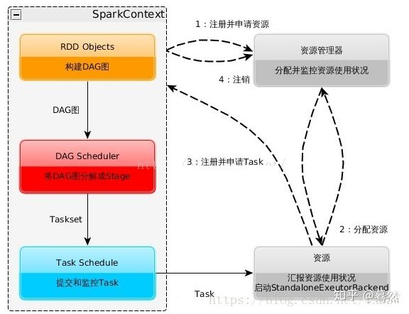

#RDD是什么  
* A Resilient Distributed Dataset (RDD), the basic abstraction in Spark.Represents an immutable,partitioned collection of elements that can be operated on in parallel.
* RDD是以下三个单词的首字母缩写（Resilient Distributed Dataset），它表示弹性分布式数据集，它是spark最基本的数据抽象，它代表了一个不可变、可分区、里面的元素可以被并行操作的集合。
  * Dataset 数据集，在这里可以理解成它是一个集合，集合中存储了很多数据
  * Distributed 它的数据是进行了分布式存储，为了方便于后期进行分布式计算
  * Resilient 弹性，rdd的数据可以保存在内存中或者是磁盘中
 
#RDD的弹性表现在哪几点？
 
1. 自动的进行内存和磁盘的存储切换；
 
2. 基于Lineage的高效容错；
 
3. task如果失败会自动进行特定次数的重试；
 
4. stage如果失败会自动进行特定次数的重试，而且只会计算失败的分片；
 
5. checkpoint和persist，数据计算之后持久化缓存；
 
6. 数据调度弹性，DAG TASK调度和资源无关；
 
7. 数据分片的高度弹性。

#RDD的五大特性
* A list of partitions
>一个RDD有很多个分区，一组分区列表.后期spark的任务是以rdd的分区为单位，一个分区对应一个task线程，spark任务最后是以task线程的方式运行在worker节点上的executor进程中
* A function for computing each split
>作用在每一个分区中的函数
`val rdd2=rdd1.map(x =>(x,1))`
* A list of dependencies on other RDDs
>一个rdd会依赖于其他多个rdd，这里就涉及到rdd与rdd之间的依赖关系，spark任务的容错机制就是根据这个特性而来
* Optionally, a Partitioner for key-value RDDs (e.g. to say that the RDD is hash-partitioned)
>（可选项） 对于kv类型的RDD才有分区函数（必须产生shuffle），如果不是kv类型的RDD它的分区函数是None-----就是表示没有。
 在spark中，有2种分区函数：
  * 第一种：HashPartitioner分区函数（默认值）   对key取hashcode值 然后对分区数取余得到对应的分区号-------> key.hashcode % 分区数= 分区号
  * 第二种：RangePartitioner分区函数 ，它是按照一定的范围进行分区，相同的范围的key会进入到同一个分区。
* Optionally, a list of preferred locations to compute each split on (e.g. block locations for an HDFS file)
>（可选项） 一组最优的数据库位置列表，数据的本地性、数据的位置最优。
  spark后期任务的计算会优先考虑存有数据的的节点开启计算任务，数据在哪里，就在当前节点开启计算任务，大大减少数据的网络传输。提升性能。

#RDD与RDD之间的依赖关系
##窄依赖
> 它指的是父RDD的partition数据最多只被子RDD的一个partition所使用
+ 比如 map/filter/flatMap等等
+ 它是不会产生shuffle

##宽依赖
>它指的是子RDD多个partition数据会依赖于父RDD的同一partition分区数据
+ 比如 reduceByKey / groupByKey /sortByKey /groupBy 等等
+ 它会产生shuffle
 
##lineage(血统)
>它就是记录下rdd上的一些转换操作，后期如果某个rdd的部分分区数据丢失之后，可以通过血统这层关系进行重，新计算来恢复得到丢失的分区数据

#RDD的缓存机制  
##rdd的缓存是什么  
>可以把rdd的数据缓存在内存或者是磁盘中，后续需要用到这份数据，就可以直接从缓存中获取得到，避免了数据的重复计算。

##如何对rdd设置缓存  
```$xslt
可以调用rdd中的cache和persist2个方法
 
cache和persist的区别：
cache：   其本质是调用了pesist方法，它是把数据缓存在内存中。
persist：可以把数据保存在内存或者是磁盘中，该方法中可以传入不同的缓存级
别，这些缓存级别都被定义在这个Object中（StorageLevel）
```

##具体使用cache和persist方法  
```$xslt
  1、需要对rdd调用cache和perisist方法
    rdd1.cache/persist(缓存级别)
  2、后续需要有触发任务执行的action操作
    比如
      rdd1.collect
```

##什么时候对rdd设置缓存  
* 某个rdd后期被使用了多次
* 经过一系列大量的算子操作之后得到了某个rdd，该RDD的数据是来之不易
   
##清除缓存  
* 系统自动清除
>当应用程序执行完成之后，缓存数据也就消失了。
* 手动清除
>rdd1.unpersist(true)

#DAG有向无环图的构建和划分stage
* Directed Acyclic Graph
  * 它是按照程序中的rdd之间的依赖关系，生成了一张有方向无闭环的图
* 后期会对DAG有向无环图划分成不同的stage（调度阶段）
  * 宽依赖是划分stage的依据


#spark工作机制


1. 构建Application的运行环境，Driver创建一个SparkContext

2. SparkContext向资源管理器（Standalone、Mesos、Yarn）申请Executor资源，资源管理器启动StandaloneExecutorbackend（Executor）

3. Executor向SparkContext申请Task

4. SparkContext将应用程序分发给Executor

5. SparkContext就建成DAG图，DAGScheduler将DAG图解析成Stage，每个Stage有多个task，形成taskset发送给task Scheduler，由task Scheduler将Task发送给Executor运行

6. Task在Executor上运行，运行完释放所有资源

#spark的优化怎么做

 spark调优比较复杂，但是大体可以分为三个方面来进行

1. 平台层面的调优：防止不必要的jar包分发，提高数据的本地性，选择高效的存储格式如parquet

2. 应用程序层面的调优：过滤操作符的优化降低过多小任务，降低单条记录的资源开销，处理数据倾斜，复用RDD进行缓存，作业并行化执行等等

3. JVM层面的调优：设置合适的资源量，设置合理的JVM，启用高效的序列化方法如kyro，增大off head内存等等

