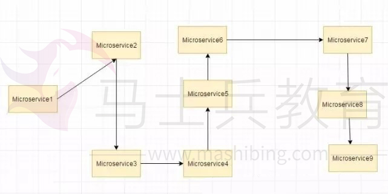
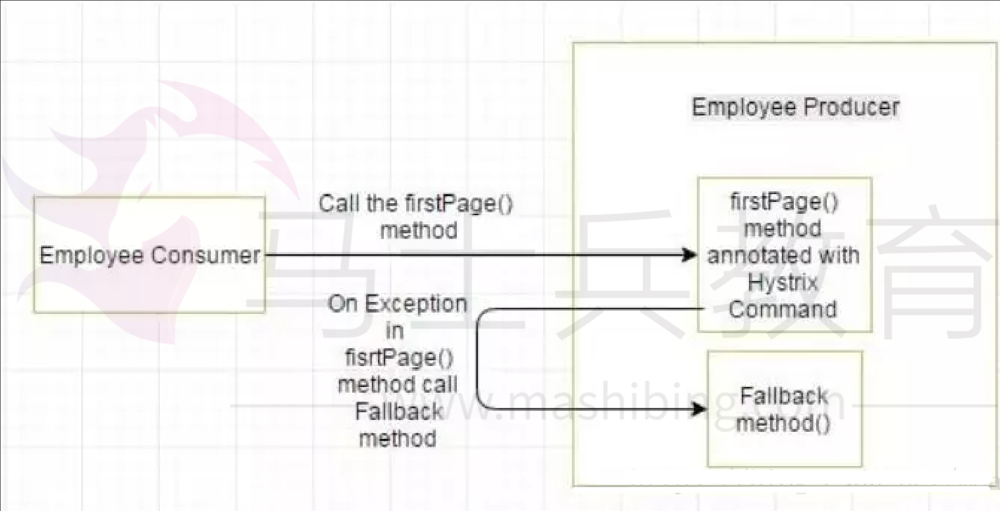
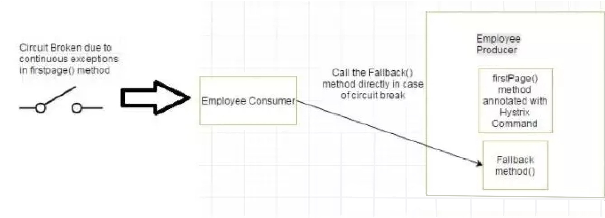
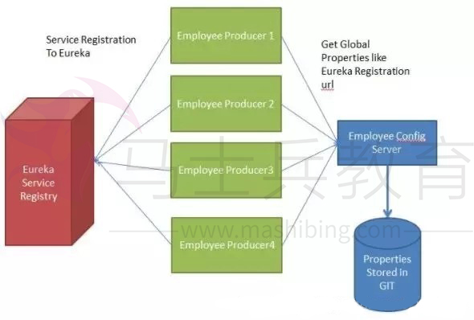
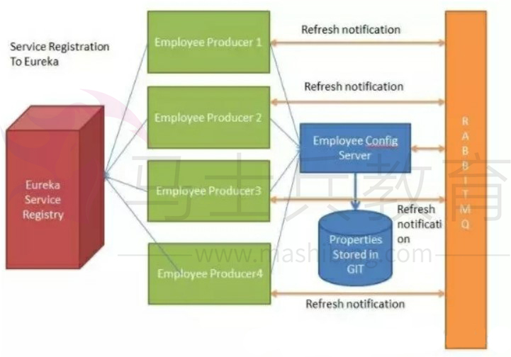

**问题一：** 

# 什么是 Spring Cloud？ 

Spring cloud 流应用程序启动器是基于 Spring Boot 的 Spring 集成应用程序，提供与外部系统的集成。

Spring cloud Task，一个生命周期短暂的微服务框架，用于快速构建执行有限数据处理的应用程序。 

 

**问题二：** 

# 使用 Spring Cloud 有什么优势？ 

使用 Spring Boot 开发分布式微服务时，我们面临以下问题 

•    与分布式系统相关的复杂性-这种开销包括网络问题，延迟开销，带宽问题，安全问题。 

•    服务发现-服务发现工具管理群集中的流程和服务如何查找和互相交谈。它涉及一个服务目录，在该目录中注册服务，然后能够查找并连接到该目录中的服务。 

•    冗余-分布式系统中的冗余问题。 

•    负载平衡 --负载平衡改善跨多个计算资源的工作负荷，诸如计算机，计算机集群，网络链路，中央处理单元，或磁盘驱动器的分布。 

•    性能-问题 由于各种运营开销导致的性能问题。 

•    部署复杂性-Devops 技能的要求。 

**问题三：** 

# 服务注册和发现是什么意思？Spring Cloud 如何实现？ 

当我们开始一个项目时，我们通常在属性文件中进行所有的配置。随着越来越多的服务开发和部署，添加和修改这些属性变得更加复杂。有些服务可能会下降，而某些位置可能会发生变化。手动更改属性可能会产生问题。 Eureka 服务注册和发现可以在这种情况下提供帮助。由于所有服务都在 Eureka 服务器上注册并通过调用 Eureka 服务器完成查找，因此无需处理服务地点的任何更改和处理。 

 

# 问题四：负载平衡的意义什么？ 

在计算中，负载平衡可以改善跨计算机，计算机集群，网络链接，中央处理单元或磁盘驱动器等多种计算资源的工作负载分布。负载平衡旨在优化资源使用，最大化吞吐量，最小化响应时间并避免任何单一资源的过载。使用多个组件进行负载平衡而不是单个组件可能会通过冗余来提高可靠性和可用性。负载平衡通常涉及专用软件或硬件，例如多层交换机或域名系统服务器进程。 

 

# **问题五：什么是 Hystrix？它如何实现容错？**  

Hystrix 是一个延迟和容错库，旨在隔离远程系统，服务和第三方库的访问点，当出现故障是不可避免的故障时，停止级联故障并在复杂的分布式系统中实现弹性。 

通常对于使用微服务架构开发的系统，涉及到许多微服务。这些微服务彼此协作。  

思考以下微服务 



假设如果上图中的微服务 9 失败了，那么使用传统方法我们将传播一个异常。但这仍然会导致整个系统崩溃。 

随着微服务数量的增加，这个问题变得更加复杂。微服务的数量可以高达 1000.这是 hystrix 出现的地方我们将使用 Hystrix 在这种情况下的 Fallback 方法功能。我们有两个服务 employee-consumer 使用由 employee-consumer 公开的服务。  

简化图如下所示  


现在假设由于某种原因，employee-producer 公开的服务会抛出异常。我们在这种情况下使用 Hystrix

定义了一个回退方法。这种后备方法应该具有与公开服务相同的返回类型。如果暴露服务中出现异常，则回退方法将返回一些值。 

# 问题六： 什么是Hystrix 断路器？我们需要它吗？  

由于某些原因，employee-consumer 公开服务会引发异常。在这种情况下使用 Hystrix 我们定义了一个回退方法。如果在公开服务中发生异常，则回退方法返回一些默认值。 



如果 firstPage method() 中的异常继续发生，则 Hystrix 电路将中断，并且员工使用者将一起跳过

firtsPage 方法，并直接调用回退方法。 断路器的目的是给第一页方法或第一页方法可能调用的其他方法留出时间，并导致异常恢复。可能发生的情况是，在负载较小的情况下，导致异常的问题有更好的恢复机会 。 



# **问题****七：** 

# **什么是** **Netflix Feign？它的优点是什么？** 

Feign 是受到 Retrofit，JAXRS-2.0 和 WebSocket 启发的 java 客户端联编程序。Feign 的第一个目标是将约束分母的复杂性统一到 http apis，而不考虑其稳定性。在 employee-consumer 的例子中，我们使用了 employee-producer 使用 REST 模板公开的 REST 服务。

但是我们必须编写大量代码才能执行以下步骤

·   使用功能区进行负载平衡。 

·   获取服务实例，然后获取基本 URL。 

·   利用 REST 模板来使用服务。 前面的代码如下

```
1.  @Controller
2.  public class ConsumerControllerClient { 3.
4.  @Autowired
5.  private LoadBalancerClient loadBalancer; 6.
7.  public void getEmployee() throws RestClientException, IOException { 
8.
9.	ServiceInstance serviceInstance=loadBalancer.choose("employee-producer"); 
10.
11.System.out.println(serviceInstance.getUri()); 
12.
13.String baseUrl=serviceInstance.getUri().toString(); 
14.
15.baseUrl=baseUrl+"/employee"; 
16.
17.RestTemplate restTemplate = new RestTemplate(); 
18.	ResponseEntity<String> response=null; 
19.	try{ 
20.	response=restTemplate.exchange(baseUrl, 
21.	HttpMethod.GET, getHeaders(),String.class); 
22.	}catch (Exception ex) 
23.	{
24.	System.out.println(ex);
25.	}
26.	System.out.println(response.getBody());
27. }
```


之前的代码，有像 NullPointer 这样的例外的机会，并不是最优的。我们将看到如何使用 Netflix Feign使呼叫变得更加轻松和清洁。如果 Netflix Ribbon 依赖关系也在类路径中，那么 Feign 默认也会负责负载平衡。

# **问题****八：**

# **什么是** **Spring Cloud Bus？我们需要它吗？**

 考虑以下情况：我们有多个应用程序使用 Spring Cloud Config 读取属性，而 Spring Cloud Config 从GIT 读取这些属性。 

下面的例子中多个员工生产者模块从 Employee Config Module 获取 Eureka 注册的财产。



如果假设 GIT 中的 Eureka 注册属性更改为指向另一台 Eureka 服务器，会发生什么情况。在这种情况下，我们将不得不重新启动服务以获取更新的属性。 

还有另一种使用执行器端点/刷新的方式。但是我们将不得不为每个模块单独调用这个 url。例如，如果

Employee Producer1 部署在端口 8080 上，则调用 http：// localhost：8080 / refresh。同样对于 Employee Producer2 http：// localhost：8081 / refresh 等等。这又很麻烦。这就是 Spring Cloud Bus 发挥作用的地方。  

 

Spring Cloud Bus 提供了跨多个实例刷新配置的功能。因此，在上面的示例中，如果我们刷新Employee Producer1，则会自动刷新所有其他必需的模块。如果我们有多个微服务启动并运行，这特别有用。这是通过将所有微服务连接到单个消息代理来实现的。无论何时刷新实例，此事件都会订阅到侦听此代理的所有微服务，并且它们也会刷新。可以通过使用端点/总线/刷新来实现对任何单个实例的刷新。